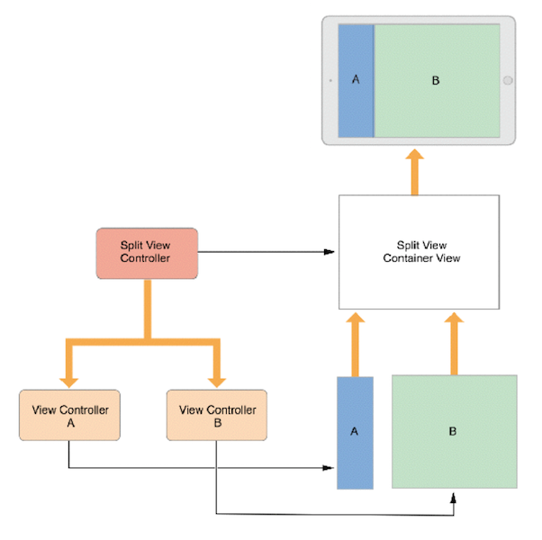
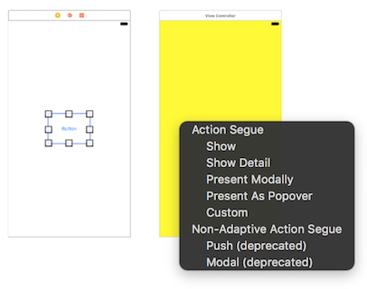
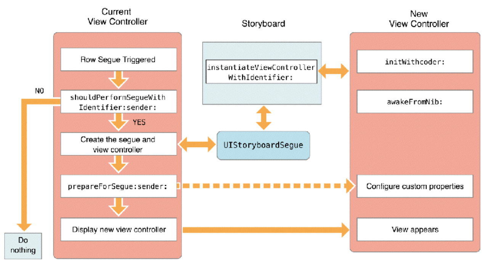
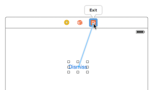

# 패스트캠퍼스 강의 노트 17th ( 20170530 )

# 오늘의 팁 - 스크롤 뷰
 - `Scroll View` > `Content View` > `Vertical Stack View`
 - `Label`에 양쪽 16 마진을 주고, `ImageView`에는 마진을 주지 않아서 보기 이쁘게 하자.
 - `Label`에 양쪽 마진을 주면, 작동에는 이상 없지만, 스토리보드에서 보이지 않는 인터페이스 빌더 버그가 나타나는데, 이를 방지 하기 위해 `Label`을 담을 `View` 하나를 넣어서 설계하도록 한다. ~그러나 사실 구동에는 전혀 쓸떼없는 것이다..~

// 본 강의노트의 폴더에 ScrollView 연습 프로젝트를 함께 넣었습니다.

# Save Data - User Default

## 데이터 저장 방법
1. 파일 저장 ( Property List, SQLite, 아카이빙 )
2. iOS DataBase이용 - Core Data
3. Network - Server DB이용

## User Default
> (한줄 요약) user default는 standard!!! 저장은 set, 오픈은 object, string.

 - 사용자의 정보를 저장하는 싱글톤 인스턴스.
 - 간단한 사용자 정보를 저장/불러오기가 가능하게 만든 인스턴스이다.
 - 내부적으로 `Plist` 파일로 저장되어 **보안이 강하지 않다.** ( 필요에 따라 암호화 필요 )
 - 보고자 한다면, 아이튠즈에서 전부 볼 수 있다.
 - 파일로 저장되기 때문에 **앱을 종료하더라도 당연히 저장되어 있다!!!**

```swift
open class var standard: UserDefaults { get }

//데이터 불러오기
open func object(forKey defaultName: String) -> Any? open func string(forKey defaultName: String) -> String? open func array(forKey defaultName: String) -> [Any]?

//데이터 저장하기
open func set(_ value: Any?, forKey defaultName: String)

//데이터 지우기
open func removeObject(forKey defaultName: String)
```

### UserDefaults 사용법
```swift
//*key값은 통일 시켜야 한다.

//데이터 저장
UserDefaults.standard.set("joo", forKey: "userID")

//데이터 불러오기
let aUser:String = UserDefaults.standard.object(forKey: "UserID") as! String
let sUser:String = UserDefaults.standard.string(forKey: "UserID")!
```

### UserDefaults 예제
 - `Button`을 누르면, `TextField`에 있는 값이 `UserDefaults`에 저장되고, 저장된 값을 `Label`에 표시한다.

```swift
@IBOutlet weak var tfInputText: UITextField!
@IBOutlet weak var lbPrintData: UILabel!
    
override func viewDidLoad() {
    super.viewDidLoad()

    lbPrintData.text = UserDefaults.standard.string(forKey: "SaveData")
    
}

@IBAction func btnSave(_ sender: UIButton) {
    UserDefaults.standard.set(tfInputText.text, forKey: "SaveData")
    lbPrintData.text = UserDefaults.standard.string(forKey: "SaveData")
}
```

# UIViewController
 - 앱의 기초가 되는 내부 구조.
 - 모든 앱은 적어도 한개 이상의 `ViewController`를 가지고 있으며 대부분의 앱은 여러 개의 `ViewController`로 이뤄져 있다.
 - `ViewController`는 사용자의 인터렉션과 앱의 데이터 사이에서 컨트롤의 역할을 한다.
 - `ViewController`는 **View 관리, 사용자 이벤트 핸들링, ViewController 간의 전환** 등을 위한 메소드와 프로퍼티를 가지고 있다.
 - View의 계층을 관리하는 기능.

## Root View
 - 모든 뷰컨트롤러는 1개의 `RootView`를 가지고 있다.
 - 화면에 표시하기 위해서 모든 뷰는 `RootView`의 계층 안에 있어야 한다.

## ViewController 특징
> Child UIViewController / User Interaction / Data Marshaling(중계자) / Resource Management
### Child UIViewController
 - `ViewController`는 다른 `ViewController`를 `Child ViewController`로 **Containe의 역할을 수행한다.**
 - `Child ViewController`의 `RootView`를 자신의 `RootView`에 `addSubView`하여 화면에 표시한다.
 - `Split View Controller`는 왼쪽 메뉴와 오른쪽 콘텐츠 화면의 경우 사용되고, iPad와 iPhone Plus 가로 화면일 때, `Split View Controller`가 허용되고, 작동시킬 수 있다.

// `Split View` 구조도


### User Interaction
 - `UIViewController`는 `UIResponder`를 상속 받은 클래스로 **이벤트 체인으로부터 오는 이벤트를 효과적으로 처리한다.**
 - 즉 사용자의 모든 이벤트는 `ViewController`가 받아서 각 `View`에 해당되는 `Method`와 `Delegate`로 처리한다.

### Data Marshaling ( 중계자 )
 - `ViewController`는 자신이 관리하는 `View`들과 **앱 내부의 데이터의 중계자 역할** 을 한다.

### Resource Management
 - `ViewController` 안에 있는 모든 `View`나 `Object`는 모두 `ViewController`의 책임이다.
 - 메모리가 부족시 `didReceiveMemoryWarning()` 메소드가 자동으로 불리며, 오랫동안 사용하지 않은 객체와 다시 쉽게 만들수 있는 객체를 제거할 수 있어 메모리를 효율적으로 관리한다.

## ViewController 종류
 - **General View Controller**
	1. UIViewController
	2. UITableViewController
	3. UICollectionViewController
 - **Container View Controller**
	1. UINavigationController
	2. UITabbarController
	3. UISplitViewController
	4. ......

### General View Controller
 - 일반적인 `View Controller` 형태
 - 각 `View Controller`가 각각의 `Root View`를 가지고 있다.
	1. `UIViewController` Root View = `UIView`
	2. `UITableViewController` Root View = `UITableView`
	3. `UICollectionViewController` Root View = `UICollectionView`

~그냥 이런게 있다..라고 알고, 뷰 컨트롤러를 써서 만들어도 괜찮다.~

### UIViewController Instance Load
 - `UIViewController` 인스턴스를 로드한다.
 - `UIViewController`를 스토리보드와 붙이려면, 아래와 같이 작성한다.

```swift
let storyboard = UIStoryboard(name: "Main", bundle: nil)
let vc = storyboard.instantiateViewController(withIdentifier: "StoryboardID")
```
### [ 예제 ] Delegate를 이용해 UIViewController를 소스로 붙이기
 - 하나의 Application은 스토리보드를 먼저 부르고, Delegate로 간다. // Application Cycle 참고.
 - 스토리보드에서 `Is initial View Controller`를 체크 해제한다. // 어떤 뷰가 제일 먼저 뜨는지 정해주지 않는다.
 - 그 후, `Delegate`에서 스토리보드와 뷰 컨트롤러를 연결해서 앱 실행 직후, 처음에 뜨는 뷰 컨트롤러가 뭔지 세팅해준다.

```swift
func application(_ application: UIApplication, didFinishLaunchingWithOptions launchOptions: [UIApplicationLaunchOptionsKey: Any]?) -> Bool {
    
    self.window = UIWindow(frame: UIScreen.main.bounds)
    
    let storyboard:UIStoryboard = UIStoryboard(name: "Main", bundle: nil)
    let viewcontroller:Leejaesung = storyboard.instantiateViewController(withIdentifier: "Leejaesung") as! Leejaesung
    
    self.window?.rootViewController = viewcontroller
    self.window?.makeKeyAndVisible()
    
    return true
}
```

# Present Modally ( 화면 전환 )

## Segue
 - 앱의 인터페이스 흐름을 정의하는 데 사용.
 - 스토리보드 내에서 두 개의 `ViewController` 사이의 화면 전환을 정의.
 - 스토리보드에서 버튼을 클릭하고, 마우스 오른쪽 버튼을 눌러서 연결하고자 하는 뷰 컨트롤러로 끌어당기면 아래와 같이 모달이 표시되고, `Present Modally`를 클릭하면 된다.



### Modifying a Segue’s Behavior at Runtime
 - `shouldPerformSegueWith`는 `YES`이면, 다음 뷰로 넘어가고, `NO`이면 넘어가지 않는다. 로그인 상태 체크할 때 같은 경우에 사용된다.
 - `prepareForSegue`는 다음 뷰 컨트롤러로 넘어가기 전에 준비하는 단계의 액션 정의이다.



### Segue를 활용한 예제
 - 소스에서 `segue`를 타이핑하면, 사용 가능한 함수들이 표시된다. ~당연한거 아닌가..~
 - `shouldPerformSegue()`
	 - true 일 때, 다음 뷰로 넘어가고, false 일 때, 그러지 못하다.
	 - 아래 소스에서는 `UISegmentedControl` 값이 true 일 때, 넘어가도록 했다.
 - `prepare()`
	 - 다음 뷰로 넘어가기 전에 준비하는 액션 정의.
	 - 아래 소스에서는 **다음 뷰에게 데이터를 던진다.**

```swift
// UISegmentedControl를 만들어서 true/false 값을 컨트롤한다.
@IBAction func thatIsOK(_ sender: UISegmentedControl) {
    if sender.selectedSegmentIndex == 0 {
        thatIsOK = true
    }else{
        thatIsOK = false
    }
}

// 버튼을 클릭했을 때, 넘어가느냐 마느냐. shouldPerformSegue의 리턴값이 true, false에 달렸다.
override func shouldPerformSegue(withIdentifier identifier: String, sender: Any?) -> Bool {
    if thatIsOK {
        return true
    }else {
        return false
    }
}

// 다음 뷰에 데이터를 던진다.
override func prepare(for segue: UIStoryboardSegue, sender: Any?) {
    let svc:nextViewController = segue.destination as! nextViewController
    svc.data = "Lee"
	//받는 뷰에서 당연히 data가 프로퍼티로 있어야만 한다.
}
```

```swift
// 이동하는 뷰에서 data를 선언해두고, 이는 위 소스의 prepare에서 던진 data를 받는다.
class nextViewController: UIViewController {
    
    var data:String?

    override func viewDidLoad() {
        super.viewDidLoad()
        
        if let name = data {
            print(name)
        }

    }
}
```

## Unwind Segue
1. 소스 상의 **되돌아 갈 예정인** `ViewController` 선택
2. 선택된 `ViewController`에 아래의 메소드 정의.
	 - 반드시 `UIStoryboardSegue` 타입의 매개변수를 받는 함수이어야 한다.
	 - 함수명이나 인자명은 중요하지 않다. // 달라도 잘 작동된다.
	 - Exit한 뷰 컨트롤러에서 던져준 `Segue`를 전달 받는 액션의 정의이고, 그래서 되돌아 가는 뷰 컨트롤러에서 액션을 정의한다.
3. **스토리보드에서** `unwind Segue` 액션이 필요한 뷰 컨트롤러에 액션과 `Exit` 연결

```swift
@IBAction func myUnwindAction(unwindSegue:UIStoryboardSegue)
```
### 스토리보드에서 Exit 연결 스크린샷



---
### 문서 끝 ( by 재성 )