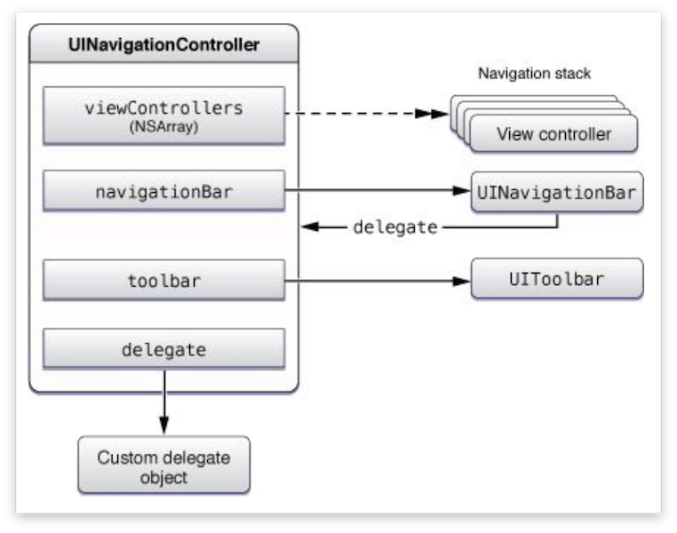
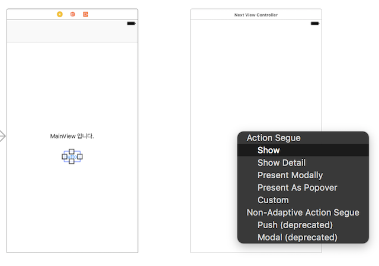

# 패스트캠퍼스 강의 노트 19th ( 20170601 )

# 오늘의 팁
 - `UIKit Catalog` by 
	 - iOS의 모든(?) UI를 데모로 돌려볼 수 있다.
	 - 애플이 손수 만든 아주 좋은 예제 소스.
	 - 관련 소스와 스토리보드 등을 참고하기에 매우매우매우(!!!) 좋다.
	 - [https://developer.apple.com/library/...](https://developer.apple.com/library/content/samplecode/UICatalog/Introduction/Intro.html)
 - 적어도 내부에서만 사용되는 함수는 `private`을 걸어주도록 하자. 함수만 봐도 내부에서 사용되는 것인지 외부에서도 사용하는지 알 수 있다.
 - `UserDefaults`에 `Array`로 값을 저장하고, 그 안에 계속 쌓아서 실제 회원가입처럼 만들 수 있다.
	 - `Array`로 저장된 데이터에 `set`을 하면, `append`가 아니고, 그냥 값을 바꿔치기 한다.
	 - 따라서.. `Array` 변수를 만들어서 `UserDefaults`에 이미 있는 데이터를 불러오고, 그 변수에 `append` 한 다음 `UserDefaults`에 `set`한다.
	 - ~실제 프로젝트에서는 서버가 있으니까, 이건 그냥 연습용....~

### `nil 결합 연산자` 
 -  `[ 핵꿀팁 ]` 변수가 옵셔널일 때, 옵셔널 바인딩 말고, 값이 없으면 기본값으로 이걸 넣어라.. 하는 명령을 줄 수 있다.
 - 물음표 2개(`??`)로 사용할 수 있다.

```swift
var userList:[Any] = UserDefaults.standard.array(forKey: "UserList") ?? []
```

> nil 결합 연산자(nil coalescing operator)는 ??(물음표 2개)로 사용한다. 연산자 앞의 값이 nil이 아니면 그 값을 사용하고 nil이면 연산자 오른쪽의 값을 사용한다. 마치 변수가 nil일 때를 대비한 기본값처럼 사용한다. -  출처: [Wish Coming True __ 3. 옵셔널](http://louet.tistory.com/97)


# `Move! Move!` Presenting a View Controller

## Segue를 이용하지 않고, 코딩으로 뷰 이동하기

### 스토리보드 인스턴스 생성

```swift
let storyboard = UIStoryboard(name: "Main", bundle: nil)
let vc = storyboard.instantiateViewController(withIdentifier: "StoryboardID")

self.present(vc, animated: true, completion: nil)
```
스토리보드로 생성된 뷰 컨트롤러는 아래와 같이 `self.`로 `UIStoryboard`를 부를 수도 있다.

```swift
let vc = self.storyboard?.instantiateViewController(withIdentifier: "StoryboardID")

self.present(vc, animated: true, completion: nil)
```
#### `dismiss`
 - `present modally`를 취소할 때, `dismiss`를 활용한다.
 - `dismiss`는 present만을 취소하며, 아래에 나오는 `push`와는 관련이 없다.

```swift
self.dismiss(animated:true, completion:nil)
```


# Alert & ActionSheet

## UIAlertController
 - Alert은 `UIAlertController`를 이용해 객체를 만들고, `self.present`한다.
 - `UIAlertController` 객체를 만들고, `UIAlertAction` 객체를 만든 다음, 컨트롤러 객체에 액션 객체를 `AddAction()`한다.
 - `UIAlertAction`은 **버튼** 이고, `handler`에 버튼을 눌렀을 때의 액션을 정의할 수 있다. `handler` 부분에서 엔터를 치면 타이핑할 수 있다.
 - `Alert`은 화면 중앙에 다이얼로그로 표현되고, 화면 아래에 붙는 것은 `ActionSheet`라고 말하며, 사용법은 `Alert`와 동일하다.

### Alert
```swift
@IBAction func showAlert() {
    let alert:UIAlertController = UIAlertController(title: "얼럿", message: "Alert입니다.", preferredStyle: .alert)
	let okButton:UIAlertAction = UIAlertAction(title: "확인", style: UIAlertActionStyle.cancel, handler: nil)
    
    let okButtonToAction:UIAlertAction = UIAlertAction(title: "확인",
                                             style: .default) { (alert:UIAlertAction) in
        print("버튼을 클릭했습니다.")
    }
    
    alert.addAction(okButton)
    self.present(alert, animated: true, completion: nil)
}
```
### ActionSheet
```swift
@IBAction func showActionSheet() {
    let alert:UIAlertController = UIAlertController(title: "액션시트", message: "ActionSheet입니다.", preferredStyle: .actionSheet)
    
    self.present(alert, animated: true, completion: nil)
}
```


# Container View Controller
 - `View Controller`의 `Container` 역할을 하는 `View Controller`를 말한다.
 - `View Controller` 간의 **구조를 잡는 역할** 을 한다.
 - 일반적으로 `Root View`를 가지고 있지 않고, `View Controller`를 `Sub View Controller`로 가지고 있다.

#### `Container View Controller의 종류`
1. `UINavigationController`
2. `UITabbarController`
3. `UISplitViewController`


## Navigation Controller
 - 컨테이너 뷰 컨트롤러이므로 `Root View`를 갖지 않는다.
 - `Navigation Controller`는 스택 구조로 뷰 컨트롤러를 쌓는다.
 - 뷰 컨트롤러를 만들 듯이 마우스로 끌어서 오거나, Xcode 메뉴바에서 `Editor - Embed in - Navigation Controller`를 사용한다.



### Action Segue를 Show로 설정
 - `Root View`에서 `Segue`를 이용해 다음 뷰로 이동시킬 때는 `Show`를 사용한다. 그래야 내비게이션 컨트롤러 안에서 움직인다.
 - `dismiss`는 이전의 `present`를 취소한다.



### 내비게이션 컨트롤러 안에서 소스를 이용해 뷰 이동
 - Segue에서는 `Show`를 활용하고, 소스에서는 `push / pop`을 이용한다. 내비게이션 컨트롤러는 스택 구조이다.

```swift
self.navigationController.pushViewController(view, animated:true)
self.navigationController.popViewController(view, animated:true)
```

#### `버튼을 누르면, 뷰를 이동하는 소스`
```swift
@IBAction func moveNextView() {
    let vc:NextViewController = self.storyboard?.instantiateViewController(withIdentifier: "Next") as! NextViewController
    self.navigationController?.pushViewController(vc, animated: true)    
}
```

---
### 문서 끝 ( by 재성 )