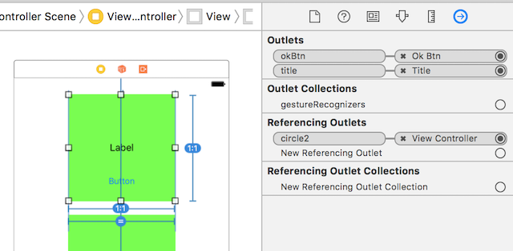
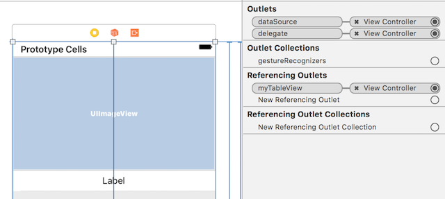

# 패스트캠퍼스 강의 노트 24th ( 20170612 )

# 오늘의 팁
## 오늘의 알고리즘

### `1 ~ N 까지의 합 구하기`

```swift
/// 1~N 까지의 합 구하기
// 반복문 사용 or 공식 사용(n*(n+1)/2). or 재귀 사용.
func sum(number n:Int) -> Int {
    var result:Int = 0
    
    if n <= 0 {
        return 0
    }else {
        result = sum(number: n-1) + n
    }
    
    return result
}
```

### `가운데 문자 출력하기`

```swift
/// 가운데 문자 출력하기
// ex) apple --> "P" / iPad --> "Pa"
func printMiddleChar(input s:String) -> String {
    var result:String = "error-"
    var myArray:[Character] = []
    
    for c in s.characters {
        myArray.append(c)
    }
    
    let arrayCount:Int = myArray.count/2
    
    if (myArray.count % 2) == 0 {
        result = "\(myArray[arrayCount-1])\(myArray[arrayCount])"
    }else {
        result = "\(myArray[arrayCount])"
    }
    
    return result
}
```

--

# CustomView

## 단순한 커스텀뷰 만들기

### `Custom View`

```swift
import UIKit

class CircleView: UIView {
    
    @IBOutlet var title:UILabel?
    @IBOutlet var okBtn:UIButton?
    

    override func awakeFromNib() {
        super.awakeFromNib()
        
        self.layer.cornerRadius = self.frame.size.width/2
        self.layer.borderColor = UIColor.black.cgColor
        self.layer.borderWidth = 2
        
        self.layer.backgroundColor = UIColor.blue.cgColor
    }
    
    func setTitleText(_ text:String) {
        if let titleLB = title {
            titleLB.text = text
        }
    }

}
```

### `ViewController`

```swift
import UIKit

class ViewController: UIViewController {
    
    @IBOutlet var circle1:CircleView?
    @IBOutlet var circle2:CircleView?
    
    override func viewDidLoad() {
        super.viewDidLoad()

        circle1?.setTitleText("첫번째")
        circle2?.setTitleText("두번째")

    }
```

### `StoryBoard`
 - 스토리보드에서 커스텀하고자 하는 뷰를 만들고, 구성 요소들(예제에서는 `Label`과 `Button`)을 넣고, `Outlets`를 커스텀한 뷰의 `Class`에 연결한다.
 - 부모 뷰의 뷰 컨트롤러에서는 당연히 커스텀한 뷰를 `IBOulets`으로 데려온다.



## Protocol & Delegate
 - 커스텀한 뷰에 있는 버튼의 액션은 뷰 `컨트롤러`에서 처리해야 하기 때문에 커스텀한 뷰에서 버튼 액션의 알림을 전달하기 위해 `Delegate`를 사용한다.
 - `Delegate`를 사용하기 위해 당연히 `Protocol`을 사용해서 약속을 맺는다.
 - 뷰에 대한 보여지는 모습은 `View`에서 처리하는 것이 맞지만, 액션에 대한 이벤트는 `View Controller`에서 처리하는 것이 맞다.


### `Custom View`

```swift
import UIKit

protocol VendingViewDelegate {
    func didSelected(item:VendingMachineView)
}

class VendingMachineView: UIView {
    
    var delegate:VendingViewDelegate?
    
    @IBOutlet var vImageView:UIImageView?
    @IBOutlet var vLabel:UILabel?

    override func awakeFromNib() {
        
    }
    
    func setImageView(fileName:String) {
        vImageView?.image = UIImage(named: fileName)
    }
    
    @IBAction func coverButtonAction(_ sender:UIButton) {
        print("coverButtonAction")
    }
}
```

### `ViewController `

```swift
import UIKit

class ViewController: UIViewController, VendingViewDelegate {
    
    @IBOutlet var vendingView:VendingMachineView?
    
    override func viewDidLoad() {
        super.viewDidLoad()

        vendingView?.setImageView(fileName: "iu_background_01.jpg")
        vendingView?.delegate = self
    }
    
    func didSelected(item: VendingMachineView) {
        item.vLabel?.text = "버튼이 눌리면, Label의 내용이 달라집니다."
    }

}
```

## Custom TableView Cell
 - `Cell`을 커스텀한다.
 - 테이블 뷰 Custom Cell을 만들고, Cell 객체를 만들 때, `UITableViewCell`이 아니므로(내가 커스텀한 cell이므로), 다운캐스팅 해야만 한다. `as! MyTableViewCell`
 - `Custom Cell`에 이미지 하나와 텍스트 하나가 있다. 그래서 Custom Cell 안에 function은 `setImage`와 `setTitle`이 있다.

### `Custom View`

```swift
import UIKit

class MyTableViewCell: UITableViewCell {
    
    @IBOutlet var albumImage:UIImageView?
    @IBOutlet var albumTitle:UILabel?

// ... 이하 생략 ... //
```

### `ViewController`

```swift
import UIKit

class ViewController: UIViewController, UITableViewDataSource, UITableViewDelegate {
    
    @IBOutlet var myTableView:UITableView?

// ... 중간 생략 ... //

    func tableView(_ tableView: UITableView, cellForRowAt indexPath: IndexPath) -> UITableViewCell {
        let myCell:MyTableViewCell = tableView.dequeueReusableCell(withIdentifier: "MyCell") as! MyTableViewCell

        myCell.albumImage?.image = UIImage(named: "iu\(indexPath.row+1).jpg")
        myCell.albumTitle?.text = "\(indexPath.row+1)"
        
        return myCell
    }

```

### `StoryBoard`




---
### 문서 끝 ( by 재성 )