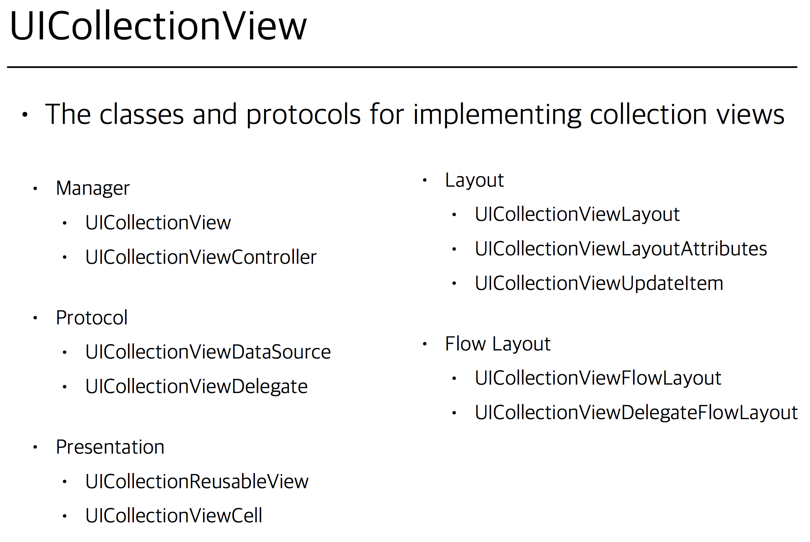
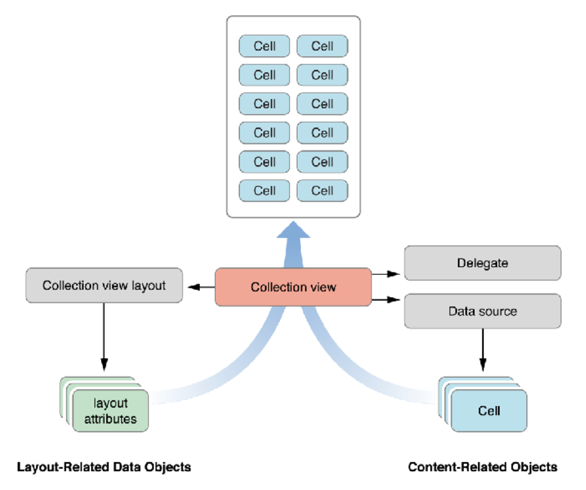
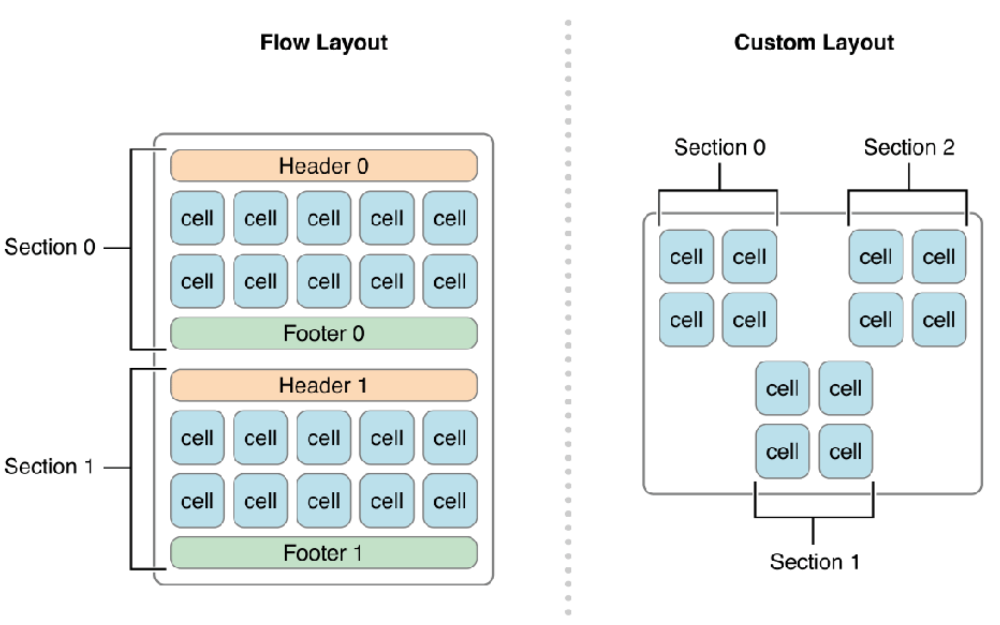
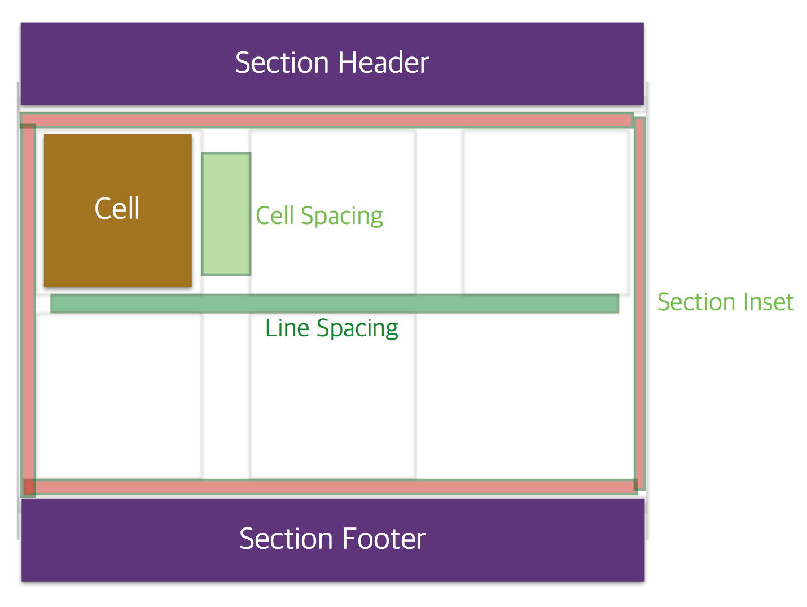

# 패스트캠퍼스 강의 노트 38th ( 20170703 )

# 오늘의 Tip
 - 테이블 뷰에서 커스텀 `Cell`을 만들 때, `Xib(닙)`으로 만들 수 있다.


# UICollectionView

 - `Cell`
 - `Decoration view`
 - `Supplementary view`: Header, Footer를 포함하는 뷰.






## Presentation
 - `UICollectionReusableView`
 - `UICollectionViewCell`
	 - `UICollectionView`는 위 2가지로 모든게 해결된다.

## Layout
 - `UICollectionViewLayout`
 - `UICollectionViewLayoutAttributes`
 - `UICollectionViewUpdateItem`
	 - `UICollectionView`는 테이블 뷰와는 다르게 좌우로 자유롭게 움직일 수 있고, Layout 안에서도 스크롤이 가능하기 때문에 Layout 이 따로 빠져 있다.

### Flow Layout & Custom Layout
 - Flow Layout이 UICollectionView의 기본적인 구조.



### Cell Sapcing & Line Spacing & Section Inset




## Protocol
 - `UICollectionViewDataSource`
 - `UICollectionViewDelegate`
 - `UICollectionViewDataSourcePrefetching`: Deque 하기 전에 미리 데이터를 땡겨와서 성능 향상을 한다.


# DataSource & Delegate

## `UICollectionViewDataSource`

```swift
// MARK: UICollectionViewDataSource

override func numberOfSections(in collectionView: UICollectionView) -> Int {
    // #warning Incomplete implementation, return the number of sections
    return 1
}


override func collectionView(_ collectionView: UICollectionView, numberOfItemsInSection section: Int) -> Int {
    // #warning Incomplete implementation, return the number of items
    return DataCenter.center.friendList.count
}

override func collectionView(_ collectionView: UICollectionView, cellForItemAt indexPath: IndexPath) -> UICollectionViewCell {
    let myCell:BasicCollectionViewCell = collectionView.dequeueReusableCell(withReuseIdentifier: reuseIdentifier, for: indexPath) as! BasicCollectionViewCell
    
    myCell.set(title: DataCenter.center.friendList[indexPath.item])
    
    return myCell
}
```

## `UICollectionViewDelegate`

 - Apple의 레퍼런스에 의하면, 아래의 순서로 Delegate 메소드가 호출된다.
 - `should`(가능 여부)를 먼저 체크하고, `did`를 실행한다.
 - `Highlight`는 touch를 시작했을 때, 호출된다.
 - `Select`는 touch를 떼었을 때, 호출된다.

> // (when the touch begins)
> 
> // 1. -collectionView:shouldHighlightItemAtIndexPath:
> 
> // 2. -collectionView:didHighlightItemAtIndexPath:
> 
> // (when the touch lifts)
> 
> // 3. -collectionView:shouldSelectItemAtIndexPath: or -collectionView:shouldDeselectItemAtIndexPath:
> 
> // 4. -collectionView:didSelectItemAtIndexPath: or -collectionView:didDeselectItemAtIndexPath:
> 
> // 5. -collectionView:didUnhighlightItemAtIndexPath:

### `[ Sample ] UICollectionViewDelegate` 실험

 - 각 Delegate 함수를 모두 호출하고, Print를 찍어 확인한다.
 - UI 상의 확인을 위해 몇개의 UI적 요소를 추가한다.
	 - `collectionView.cellForItem(at: indexPath)?.backgroundColor = UIColor.black`

```swift
// MARK: ***** UICollectionViewDelegate *****
    
// (when the touch begins)
// 1. -collectionView:shouldHighlightItemAtIndexPath:
func collectionView(_ collectionView: UICollectionView, shouldHighlightItemAt indexPath: IndexPath) -> Bool {
    print("shouldHighlightItemAt \(indexPath)")
    
    return true
}
    
// 2. -collectionView:didHighlightItemAtIndexPath: item에 touch를 시작했을 때, Highlight가 됩니다.
func collectionView(_ collectionView: UICollectionView, didHighlightItemAt indexPath: IndexPath) {
    print("didHighlightItemAt \(indexPath)")
    
    collectionView.cellForItem(at: indexPath)?.backgroundColor = UIColor.orange
}
    
    
// (when the touch lifts)
// 3-a. -collectionView:shouldSelectItemAtIndexPath:
func collectionView(_ collectionView: UICollectionView, shouldSelectItemAt indexPath: IndexPath) -> Bool {
    print("shouldSelectItemAt \(indexPath)")
    return true
}
    
// 3-b. -collectionView:shouldDeselectItemAtIndexPath:
func collectionView(_ collectionView: UICollectionView, shouldDeselectItemAt indexPath: IndexPath) -> Bool {
    print("shouldDeselectItemAt \(indexPath)")
    return true
}
    
// 4-a. -collectionView:didSelectItemAtIndexPath: item에 touch를 끝낼 때, 실행됩니다.
func collectionView(_ collectionView: UICollectionView, didSelectItemAt indexPath: IndexPath) {
    print("didSelectItemAt \(indexPath)")
    
    if collectionView.cellForItem(at: indexPath)?.backgroundColor == UIColor.black {
        collectionView.cellForItem(at: indexPath)?.backgroundColor = UIColor.clear
    }else {
        collectionView.cellForItem(at: indexPath)?.backgroundColor = UIColor.black
    }
}
    
// 4-b. -collectionView:didDeselectItemAtIndexPath: 다른 item을 Select하면서 원래 선택된 item이 Deselect 됩니다.
func collectionView(_ collectionView: UICollectionView, didDeselectItemAt indexPath: IndexPath) {
    print("didDeselectItemAt \(indexPath)")
    
    collectionView.cellForItem(at: indexPath)?.backgroundColor = UIColor.gray
}
    
// 5. -collectionView:didUnhighlightItemAtIndexPath:
func collectionView(_ collectionView: UICollectionView, didUnhighlightItemAt indexPath: IndexPath) {
    print("didUnhighlightItemAt \(indexPath)")
}
```

### `결과`
 - [0, 0]의 item을 터치하고, [0, 1]의 item을 터치한 결과.
 - `Apple`의 가이드와는 다르게 `shuouldSelectItemAt`보다 `didUnhighlightItemAt`이 먼저 불린다.
 - **한줄요약** : `Hightlight`를 체크하고, `Select`를 진행한다.

```
shouldHighlightItemAt [0, 0]
didHighlightItemAt [0, 0]
didUnhighlightItemAt [0, 0]
shouldSelectItemAt [0, 0]
didSelectItemAt [0, 0]
shouldHighlightItemAt [0, 1]
didHighlightItemAt [0, 1]
didUnhighlightItemAt [0, 1]
shouldSelectItemAt [0, 1]
didDeselectItemAt [0, 0]
didSelectItemAt [0, 1]
```


# [ Sample ] Multiple-Selection

## 1. MultipleSelection 허용

```swift
self.collectionView?.allowsMultipleSelection = true
```

```obj-c
@property (nonatomic) BOOL allowsSelection; // default is YES
@property (nonatomic) BOOL allowsMultipleSelection; // default is NO

- (BOOL)collectionView:(UICollectionView *)collectionView
  shouldSelectItemAtIndexPath:(NSIndexPath *)indexPath;
- (BOOL)collectionView:(UICollectionView *)collectionView
  shouldDeselectItemAtIndexPath:(NSIndexPath *)indexPath;
// called when the user taps on an already-selected item in multi-select mode
```

## 2. 삽입 / 삭제 / 이동

 - `performBatchUpdates` 메소드의 `update` 클로져를 사용해서 `Section`이나 `Item`의 업데이트 행동을 실행.
 - 두가지 스텝을 필수로 진행해야한다.
	1. 데이터 업데이트
	2. UI 업데이트 - `CollectionView`의 해당 메소드를 호출.

```swift
func performBatchUpdates(_ updates: (() -> Swift.Void)?, completion: ((Bool) -> Swift.Void)? = nil)
```

### `[Sample] Delete`

```swift
func deleteSelectedItem()
{
    self.collectionView?.performBatchUpdates({
        if let selectedItem = self.collectionView?.indexPathsForSelectedItems
        {
			// 데이터 소스에서 항목 삭제
			// 뷰에서 제거
            self.collectionView?.deleteItems(at: selectedItem!)
        }
	}, completion: { (isSuccess) in
		//완료후 행동
	})
}
```


# [Sample] LongPressGesture

 - LongPressGesture로 CollectionView의 요소들을 Touch-Drag 하기.

```swift
class ViewController: UIViewController, UICollectionViewDataSource, UICollectionViewDelegateFlowLayout {
  
 var longPressGesture:UILongPressGestureRecognizer?
  
 override func viewDidLoad() {
    super.viewDidLoad()
    data = CollectionData()
    
   longPressGesture = UILongPressGestureRecognizer(target: self, action: #selector(ViewController.handleLongGesture(gesture:)))
	}


func handleLongGesture(gesture: UILongPressGestureRecognizer) {
    switch(gesture.state) {
  
   case .began:
      guard let selectedIndexPath = self.collectionView.indexPathForItem(at: self.collectionView)) else { break }
      print(“began”)
      collectionView.beginInteractiveMovementForItem(at:selectedIndexPath)
   case .changed:
   collectionView.updateInteractiveMovementTargetPosition(gesture.location(in:gesture.view!))
      print(“move”)
    case .ended:
      collectionView.endInteractiveMovement()
      print(“end”)
    default:
      collectionView.cancelInteractiveMovement()
    }
  }

}
```

---
### 문서 끝 ( by 재성 )