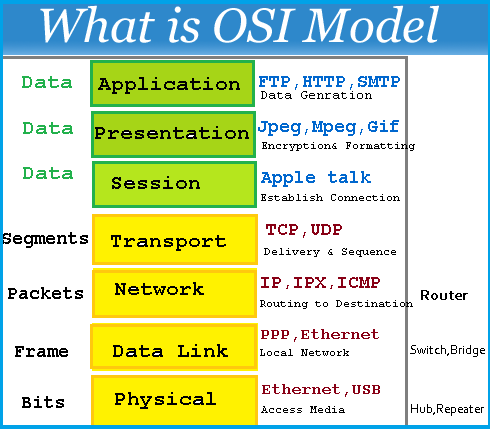
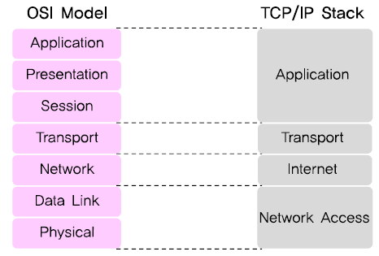

# 패스트캠퍼스 강의 노트 43th ( 20170718 )

# [ Network ] OSI 7 Layer
 - `개방형 시스템 상호 연결 표준 모델`
 - `OSI`: **Open System Interconnection**
 - 많은 기기들 간의 네트워크 연결에 있는 어려움과 호환성 결여를 막기 위해 `ISO(국제 표준화 기구)`에서 OSI 참조 모델을 1984년에 제시하였습니다.
 - 모든 시스템들의 상호 연결에 있어 문제가 없도록 하는 것에 목표를 두고 있으며, 7개의 계층으로 구분됩니다.
 - 우리가 보통 인터넷 연결이라고 하는 `TCP/IP`는 OSI 참조 모델을 기반으로 상업적이고, 실무적으로 이용될 수 있도록 단순화된 대표적인 모형입니다.

---

# ★ 재성's 마음대로 쓰는 OSI-7-Layer ★
// OSI 7계층을 너무 어렵게 접근하지 않고, 전체적인 시야로 OSI 7 계층을 보기 위해 풀어가는 글입니다. ~믿든지 말든지는 읽는 당신의 선택.b~

## `OSI 7계층이 필요한 이유`
 - 지금은 인터넷이 아주 흔한 시대이지만, 과거 PC가 처음 등장하고 대중화되면서, 여러 컴퓨터 제조사들로부터 컴퓨터 사이의 연결을 시도하는 노력들이 이어졌습니다. 그러나 각 제조사들이 표준 규격 즉, 통일된 약속(a.k.a `프로토콜`)이 없이, 각자 자기들만의 규격을 내세우면서 오히려 각 컴퓨터들 간의 연결이 쉽지 않은 상황이 발생했습니다..
 - 대표적인 사례(?)로 제대로 된 상용 PC를 처음 만들었던 애플은 [AppleTalk](https://ko.wikipedia.org/wiki/애플토크)라는 규격을 만들기도 했었습니다. ~그리고 애플토크는 TCP/IP에 밀려서..~ ~그리고 사실 애플이 애플토크를 만들었던 시점에는 ISO에서 OSI 7계층을 준비하고 있던 때였..~
 - 이러한 시장 상황을 정리하고, 이를 표준화하기 위해 [ISO(전세계 표준을 만드는 기관..)](https://ko.wikipedia.org/wiki/국제_표준화_기구)에서 1984년에 만든 일종의 모델입니다. 이 표준이 만들어진 이후 컴퓨터 시장에서는 통신 기기나 컴퓨터의 제조 원가 절감과 전문화된 기기의 제조 등이 가능해졌습니다.

## `그런데 우리가 이를 배우는 이유는?`
 - `스탠다드`: Standard. 즉, 표준이기 때문에 우리가 만든 서비스에서 네트워크를 통한 데이터 이동이 어떻게 이루어지는 알아야 백엔드-클라이언트 개발자들 간에 대화가 가능합니다. 또한, ~언젠가~ 다른 통신 계층의 이해가 필요할 때, OSI와의 비교로 이해하기 수월하게 있습니다. ( ex. [Bluetooth](https://www.physicsforums.com/threads/osi-7-layers-where-does-the-protocol-fit-in.759308/) )
 - `데이터 흐름 파악`: 전체적으로 정리된 데이터의 흐름을 알 수 있습니다. ( 아~ 지금 내 데이터가 여기쯤 있구나~ )
 - `문제 해결`: 네트워크나 데이터 이동에 있어 문제가 발생했을 때, OSI 7계층에 따라서 문제의 원인을 파악하는 것이 수월합니다. 예를 들어, 서비스 장애가 발생했을 때, 서버와 클라이언트 각자에서는 문제가 없는 것이 확인 되었다면, OSI 7계층에 따라서 추적할 수 있습니다. 서버와 연결된 공유기, 스위치, 라우터에는 문제가 없는지, 심지어 서버와 연결된 케이블(물리 계층)에는 문제가 없는지 등을 단계별로 파악할 수 있습니다. ( 예를 들어, ~제 전 직장에서는~ 서버 문제가 아닌 것을 확인하면, 가비아나 AWS 상태를 확인하고, 그 다음 통신사를 파악하는 단계로 문제 원인을 파악했어요. )

## [ OSI 7계층 따라가기 1 ] `OSI 7계층에 따른 데이터 이동`
 - 클라이언트(iOS)에 있는 우리 앱에서 데이터를 서버로 **보낸다!** 라는 버튼을 누르면, OSI 7계층을 `7, 6, 5, 4, 3, 2, 1`의 순서로 타고, 백엔드(서버)에서는 다시 이를 **받는 과정** 에서 `1, 2, 3, 4, 5, 6, 7`의 순서로 데이터를 전송 받습니다.
 - 7계층에서 `5, 6, 7 계층`을 **상위계층** , `1, 2, 3, 4 계층`을 **하위계층** 이라고 하는데, 이런 구분보다는...
	 - `상위계층`은 `사용자`를 위한 계층으로 **실질적인 데이터를 생성** 합니다.
	 - `하위계층`은 `컴퓨터`를 위한 계층으로 **데이터의 흐름과 전송을 담당** 합니다.
 - 따라서 우리는 사실 실제 앱 서비스를 만들 때는 상위계층을 자주 만나게 되고, 하위계층은 우리가 사용하는 프레임워크나 OS단, 통신망, 통신사가 ~아마도~ 알아서 해줄 거예요. ~그래도 알고 있어야 문제 해결이 가능하겠..~

## [ OSI 7계층 따라가기 2 ] `상위 계층`
 - 우리가 만든 앱이 서버에 `사진을 올리는 앱`이라고 가정해보겠습니다.
 - 그리고 `계층` 즉, `Layer`는 `L`로 표현할게요.
 - `상위계층`은 사용자를 위한 계층으로 **실질적인 데이터를 생성** 합니다.

### `L7 Application (응용 계층)`
 - L7, `Application layer`는 사용자에게 인터페이스와 네트워크 서비스를 제공합니다..는 무슨 소리냐면.. 사용자가 인터넷을 쓸 때, 웹사이트에 접속할 수도 있지만, 메일을 보낼 수도 있고, 파일을 전송할 수도 있죠. 사실 지금은 `HTTP`를 제일 많이 사용하기는 하지만, `프로토콜` 즉, 약속은 여러개로 나뉘어 있어요. 파일을 전송할 때 많이 사용하는 `FTP`, 메일을 전송할 때 사용하는 `SMTP` 등등.
 - `HTTP`는 웹사이트를 요청하고 다운로드할 때, 사용되는 프로토콜입니다.
 - 우리는 `HTTP` 프로토콜을 사용해서 이미지를 보내겠고, 요놈을 활용해 인터넷으로 이미지를 보낼 수 있는 데이터를 만듭니다. 네트워크 프레임워크를 사용해보면 알게될 거예요. ~(묵념...)~
 - 참고로.. `카카오톡`은 과거에 `HTTP 프로토콜`을 이용해 메시지를 주고 받았다가 `겁나 빠른 황소 프로젝트`( ~기억이 나신다면 아재..~ )를 통해 [자체적으로 구축한 프로토콜로 이전했습니다](https://www.bpak.org/blog/2012/12/kakaotalk-loco-프로토콜-분석-1/).
 - **한줄요약:** L7은 `사용자를 도와 데이터를 생성하는 계층`입니다.

### `L6 Presentation (표현 계층)`
 - L6, `Presentation Layer`는 `파일 확장자`를 생각하면 쉽습니다. 우리는 이미지를 보낼 거니까, L6 단계에서는 `jpeg`를 떠올리면 됩니다.
 - jpeg 뿐만 아니라, 동영상은 `#MPEG`, 윈도우에서 파일을 왔다갔다 할 때는 `#SMB`, 애플의 맥에서 파일을 왔다갔다 할 때는 `#AFP` 등의 프로토콜이 사용됩니다. 프로토콜은? `약속`입니다.
 - **한줄요약:** L6는 L7에서 만들어진 데이터를 `컴퓨터가 알아들을 수 있도록 데이터 표현 방식(확장자)을 알려주는 단계`입니다.

### `L5 Session (세션 계층)`
 - L5, `Session Layer`는 연결 상태 체크를 담당하는데, 쉽게 말해(?) `응용 프로그램 또는 네트워크 사이에 연결을 시도, 유지, 상태 체크 등`을 담당합니다.
 - 즉, 이미지가 서버로 가는 도중에 연결이 끊어진다면, 요 세션 계층이 다시 연결을 시도해봅니다. 여러번 시도하다가 아니다 싶으면, 우리에게 알려주죠. ~야. 연결 끊어졌는데, 어떻게 할까. 다시 시도해봐? 아님 말아?~
 - 세션은 더 쉽게(?) 생각하면, 인터넷 뱅킹에서 많이 보는데( ~사실은 조금 다르긴 하지만..~ ), 인터넷 뱅킹에서 로그인을 해놓고, 10분 이상 가만히 있으면, "세션이 만료되어 자동으로 로그아웃합니다."라고 하는데, 이와 비슷하다고 할 수 있어요. 우리는 세션 레이어 덕분에 네트워크 연결이 끊어졌는지 아닌지 체크하는 액션을 따로 만들지 않아도 됩니다. ~프레임워크가 사실 다 해주거든요...~
 - **한줄요약:** L5는 `응용 프로그램 혹은 네트워크 사이의 연결을 관리, 담당`하는 계층입니다.

// 자, 그럼 상위 계층에서는 이렇게 해서 나의 데이터를 만들었고, 이를 네트워크에 태울 준비가 완료되었습니다. 하위계층에서는 진짜 네트워크에 데이터를 태워봅니다.

## [ OSI 7계층 따라가기 3 ] `하위 계층`
 - `하위계층`은 컴퓨터를 위한 계층으로 **데이터의 흐름과 전송을 담당** 합니다.

### `L4 Tranport (전송 계층)`
 - L4, `Transport Layer`는 그 유명한 `TCP/UDP`입니다. ~뭐래....~ ~일단, 들어보시죠..~
 - **TCP** 는 `Transmission Control Protocol`의 약자이고, **확인 응답 절차** 를 걸치기 때문에 신뢰성이 있습니다.
 - **UDP** 는 `User Datagram Protocol`의 약자이고, 신뢰성은 없으나 오버헤드가 작기 때문에 **속도가 빨라지게** 됩니다.
 - 쉽게 말하면.. TCP는 데이터를 잘 받았니 못 받았니 물어보느라 살짝 느리고, UDP는 그렇지 않다는 뜻입니다.
 - 즉, 위에서 이야기했듯이 하위계층은 데이터의 실질적인 흐름과 전송을 담당하는데, `그 데이터 흐름과 전송의 스타트를 결정하는 계층`이고, 그 시작점에서 택배(`응답 확인을 걸치는 TCP`)인지 그냥 편지(`막 보내기만 하는 UDP`)를 선택하는 단계입니다.
 - 그리고 그 방법을 선택했으면, `포트(Port)`를 결정합니다. 포트는 L7에서 했던 `HTTP`를 L4 단계에서 알려주는 일종의 방법이고, HTTP는 보통 80번 포트를 사용합니다. ~나중에 백엔드 쪽에 80번 포트 좀 열어주세요.. 라고 하시게 될 거예요..~
 - **한줄요약:** L4는 `데이터 전송 방식을 결정하고, 서비스의 포트 번호를 구별`하는 계층이며, `TCP/UDP` 그리고 `HTTP's port number: 80`을 기억하면 됩니다.

### `L3 Network (네트워크 계층)`
 - L3, `Network Layer`.. 여기에서 바로 목적지까지 가는 최적의 경로를 결정합니다. 바로 `Internet Protocol address` 일명 `IP 주소`를 여기서 활용하게 되지요.
 - 보통 우리가 서버에 데이터를 보낸다고 하면, 서버의 IP 주소를 프레임워크에게 알려주는데, 이 IP 주소를 이용해서 **최적의 경로** 를 L3가 결정합니다.
 - 그리고 그 최적의 경로를 `Routing Protocol`라고 합니다.
 - **한줄요약:** L3는 논리적 주소를 기반으로 `논리적 주소를 기반으로 출발지에서 목적지까지 가는 최적의 데이터 경로를 결정`하는 계층입니다.

### `L2 Data Link (데이터링크 계층)`
 - 위에서 논리적 주소는 IP 주소라고 했는데, 사실 IP 주소는 고유하면서 유동적이기도 하고, 고유하면서 상대적이기도 합니다. ~( 응?? )~
 - 서버의 IP 주소는 백엔드 구조에 따라 고정 IP이기도 하고, 자주 바뀌기도 할거예요. 그리고 그걸 알려주는 도구들도 있으니까, 걱정할 필요는 없습니다. 어쨌든, 그래서 이를 `논리적 주소`라고 부릅니다. ~맞는 설명인지 아리송.. 저는 이렇게 이해하고 있어요...~
 - 예를 들어, 우리집에 인터넷 선이 1개 들어온다면, 우리집에는 통신사가 할당해준 `1개의 IP`가 들어옵니다. 그리고 공유기가 이를 받아서 내부에서만 아는 `내부 IP`로 바꿔주고, 각 기기들은 내부 IP를 받게 되지요. 내가 집에 있는 컴퓨터에 접속하려면, 우리집의 IP 주소를 치고, 우리집에 있는 공유기에게 내부 IP 주소를 물어봐야 합니다. 뭐, 얼추 이런 모양이고, 이 IP 주소를 우리나 우리가 만든 클라이언트(iOS)가 모두 기억하지는 못하니까.. `DNS` 즉, `도메인`을 사용하기도 합니다. 도메인에다가 IP를 등록해놓고, 도메인은 바꾸지 않고, IP주소가 바뀌면 도메인에 등록된 IP를 바꾸는 거지요.
 - 그.런.데. `MAC Address`라는 녀석은 정말 기기 하나의 고유한 값입니다. ~Macbook의 맥과는 전혀.. 상관이 없어요.~
 - [맥 어드레스](https://ko.wikipedia.org/wiki/MAC_주소)는 쉽게 말해서 통신하는 기기의 `주민등록번호`에 가깝고, 실제로 이를 어떤 서비스 업체가 수집하는 것도 [논란이 될 수 있습니다](http://it.donga.com/15043/). 
 - 예를 들어서, 해커가 어떤 노트북으로 자꾸 내 서비스에 해킹을 시도하는데, 내가 그 해커의 IP 주소를 막으면, 해커는 와이파이를 끄고 테더링을 하면, IP주소를 통신사로부터 새로 할당 받으므로 또 다시 해킹 시도가 가능합니다. 그런데, 내가 그 해커의 맥 어드레스를 막아버리면, 해커는 노트북을 바꿔야만 해킹 시도가 가능하지요. ~대충 이런 모양입니다..~
 - 어쨌든, L2, `Data Link Layer`는 **물리적 주소인 맥 어드레스** 를 가지고 목적지까지 가는 데이터 전송 형태를 결정하고, 굳이 예를 든다면, 공유기한테 진짜 받아야 할 서버를 맥 어드레스로 알려주고, 가는 방법을 결정할 수 있겠죠.
 - **한줄요약:** L2는 물리적 주소(MAC Address)를 기반으로 `노드 대 노드(Point-To-Point)로 데이터 전송 형태를 결정`하는 계층입니다.

### `L1 Physical (물리 계층)`
 - ~자. 이제 거의 다 왔..~
 - L1은 광섬유인지 LTE인지 등등 진짜 계층 이름(물리 계층)대로 물리적인 통신 방법을 말합니다.
 - 컴퓨터는 알다시피 0과 1 밖에 알아들을 수 없고, `0은 전기가 끊어진 것`, `1은 전기가 연결된 것`을 말합니다.
 - L1 단계에서는 L2까지 온 데이터를 `컴퓨터가 이해할 수 있는` 0과 1 즉, **Bit** 로 바꿔서 실제 물리적인 방법으로 데이터를 목적지까지 보내버립니다.
 - 이렇게 만든 0과 1을 이용해 전기를 연결했다 끊었다가 하면서 데이터를 목적지로 보냅니다. 물론, 보통 이 과정은 보통 통신사가 알아서 하겠죠. (...)
 - **한줄요약:** L1은 최종적으로 L2까지 만들어진 `데이터 프레임`을 컴퓨터가 이해할 수 있는 `2진수(bit)`로 변환하고, 전기적인 신호로써 전송로를 통해 목적지까지 실직적인 데이터를 전달하는 계층입니다.

// 이렇게 해서.... 데이터가 서버로 보내졌구요. 백엔드(서버)는 이제 이 과정을 반대로 올라타고 가서 데이터를 서버가 알아듣습니다. ~그리고 솔직히 하위계층은 훨씬 더 많은 공부가 필요해요...~

// ~이 험난한 과정을 어떻게 그렇게 빠르게 할 수 있는지 기술의 발전이란....~

// 이 아래로는 제가 이론적으로 정리한 내용이며, OSI 7계층에 대해 구글링을 하면, 훨씬 더 고급진(...) 정보들을 보실 수 있습니다.

// 읽어주셔서 고맙습니다. (_ _)

---

## OSI 7 Layer (개요)

1. `7 Layer`: **Application (응용 계층)** `#서비스_제공` //프로토콜: `#HTTP`, `#FTP`, `#DNS`, `#DHCP`
2. `6 Layer`: **Presentation (표현 계층)** `#이해할_수_있는_포맷으로_변환` //프로토콜: `#JPEG`, `#MPEG`, `#SMB`, `#AFP`
3. `5 Layer`: **Session (세션 계층)** `#응용_간의_질서_제어` //프로토콜: `#SSH`, `#TLS`
4. `4 Layer`: **Transport (전송 계층)** `#게이트웨이` //프로토콜: `#TCP`, `#UDP`, `#ARP`
5. `3 Layer`: **Network (네트워크 계층)** `#라우터` //프로토콜: `#IP`, `ICMP`, `IGMP`
6. `2 Layer`: **Data Link (데이터링크 계층)** `#브리지_&_스위치` //프로토콜: `#MAC`, `PPP`
7. `1 Layer`: **Physical (물리 계층)** `#허브_&_리피터` //프로토콜: `#Ethernet.RS-232C`

## OSI 7 Layers (자세한 설명)

1. `7 Layer`: **Application (응용 계층)**
 - 한줄요약: `#서비스_제공`
 - 프로토콜: `#HTTP`, `#FTP`, `#DNS`, `#DHCP`, `#SMTP`, `#SNMP`, `#SSH & Scp`, `#NFS`, `#RTSP`
 - 설명: 사용자가 네트워크에 접근할 수 있도록 해주는 계층이며, 사용자 인터페이스나 전자우편, 데이터베이스 관리 등의 **서비스** 를 제공합니다.
2. `6 Layer`: **Presentation (표현 계층)**
 - 한줄요약: `#이해할_수_있는_포맷으로_변환`
 - 프로토콜: `#JPEG`, `#MPEG`, `#SMB`, `#AFP`
 - 설명: 운영체계의 한 부분으로서 입력 혹은 출력되는 데이터를 **하나의 표현 형태로 변환하기 위해 필요한 번역** 을 수행하여 두 장치가 일관되게 전송 데이터를 서로 이해할 수 있도록 합니다. 제어코드나 문자, 그래픽 등의 확장자와 관련이 있습니다.
3. `5 Layer`: **Session (세션 계층)**
 - 한줄요약: `#응용_간의_질서_제어`
 - 프로토콜: `#SSH`, `#TLS`, `#ISO 8327`, `#RPC`, `#NetBIOS`, `#AppleTalk`
 - 설명: 통신 세션을 구성하는 계층으로서 **포트 연결** 이라고도 할 수 있습니다. **통신장치 간의 상호작용** 을 `설정`하고, `유지`하며, `동기화`하고, 사용자 간의 **포트 연결(세션)** 이 `유효`한지 확인 및 설정합니다.
4. `4 Layer`: **Transport (전송 계층)**
 - 한줄요약: `#게이트웨이`
 - 프로토콜: `#TCP`, `#UDP`, `#ARP`, `#RTP`, `#SCTP`, `#AppleTalk`
 - 설명: 전체 메시지를 발신지 대 목적지(종단 간 종단)간의 제어와 에러를 관리합니다. **패킷들의 전송이 유효한지 확인** 하고, 실패한 패킷은 다시 보내는 등 **신뢰성 있는 통신을 보장** 할 뿐만 아니라, 머리말에는 세그먼트(Segment)가 포함됩니다.
5. `3 Layer`: **Network (네트워크 계층)**
 - 한줄요약: `#라우터`
 - 프로토콜: `#IP`, `ICMP`, `IGMP`, `#X.25`, `#CLNP`, `#ARP`, `#RARP`, `#BGP`, `#OSPF`, `#RIP`, `#IPX`, `#DDP`
 - 설명: 다중 네트워크 링크에서 패킷(Packet)을 발신지로부터 목적지로 전달할 책임을 갖습니다. L2(2계층)은 노드 대 노드의 전달을 감독하고, L3(3계층)은 각 패킷이 시작 시점에서 **최종 목적지까지 성공적이고 효과적으로 전달** 되도록 하는 것에 목적이 있습니다.
6. `2 Layer`: **Data Link (데이터링크 계층)**
 - 한줄요약: `#브리지_&_스위치`
 - 프로토콜: `#MAC`, `PPP`, `#Ethernet`, `#Token Ring`, `#HDLC`, `#Frame Relay`, `#ISDN`, `#ATM`, `#Wireless LAN`, `#FDDI`
 - 설명: 오류 없이 한 장치에서 다른 장치로 **프레임** (Frame //feat. `비트의 모음`)을 전달하는 역할을 하고, 스위치 같은 장비는 `MAC Address`를 이용하여 정확한 장치로 정보를 전달합니다. L3에서 정보를 받아 **주소와 제어 정보를 시작과 끝(Header, Tail)에 추가** 합니다.
7. `1 Layer`: **Physical (물리 계층)**
 - 한줄요약: `#허브_&_리피터`
 - 프로토콜: `#Ethernet.RS-232C`, `#전선`, `#전파`, `#광섬유`, `#동축케이블`, `#도파관`, `#PSTN`, `#Repeater`, `#DSU`, `#CSU`, `#Modem`
 - 설명: 물리적 매체를 통해 비트(Bit)의 흐름을 전송하기 위하여 요구되는 기능들을 조정하는 단계를 말합니다. 케이블이나 연결 장치 등과 같은 기본적인 물리적 연결기의 전기적 명세를 정하고 네트워크의 두 노드를 물리적으로 연결시켜 주는 신호방식을 다룹니다.

( ↑ 이미지 출처: [http://technet2u.com/what-is-osi-model/](http://technet2u.com/what-is-osi-model/) )

## TCP/IP 4 Layer
 - **TCP/IP 4 Layer** 는 `인터넷 모델`이라고도 불린다.
 - **OSI 7 Layer** 를 `이론상 표준`이라고 한다면, **TCP/IP 4 layer** 는 `사실상 표준`이라고 할 수 있다.
 - 5, 6, 7 계층을 묶어서 `Application` 계층으로 부르고, 4계층 `Transport`는 그대로 `Transport`, 3계층 `Network`는 `Internet`으로, 1, 2계층을 묶어서 `Network Access` 계층으로 부른다.

( ↑ 이미지 출처: [http://saysecurity.tistory.com/14](http://saysecurity.tistory.com/14) )

1. `4 Layer`: **Application (응용 계층)**
 - OSI: `5, 6, 7 Layer`
 - 프로토콜: `#HTTP`, `#FTP`, `#Telnet`, `#DNS`, `#SMTP`
 - 설명: TCP/IP 기반의 `응용 프로그램`을 구분할 때, 사용합니다.
2. `3 Layer`: **Transport (전송 계층)**
 - OSI: `4 Layer`
 - 프로토콜: `#TCP`, `#UDP`
 - 설명: 통신 노드 간의 `연결을 제어`하고, `자료의 송수신`을 담당합니다.
3. `2 Layer`: **Internet (인터넷 계층)**
 - OSI: `3 Layer`
 - 프로토콜: `#IP`, `#ARP`, `#RARP`, `#ICMP`, `#OSPF`
 - 설명: 통신 노드 간의 `IP 패킷을 전송`하는 기능 및 `라우팅` 기능을 담당합니다.
4. `1 Layer`: **Network Interface (네트워크 인터페이스 계층)**
 - OSI: `1, 2 Layer`
 - 프로토콜: `#Ethernet`, `#Token Ring`, `#PPP`
 - 설명: CSMA/CD, MAC, LAN, X.25, 패킷망, 위성 통신, 모델 등 `전송`에 사용됩니다.

---

# `Reference Link`
 - `OSI 7계층(OSI 7 Layer)과 TCP/IP 4계층 (심화) / 네이버 블로그` - [바로가기](http://blog.naver.com/demonicws/40117378644)
	 - 전체적인 이론을 쭉 훑어볼 수 있습니다.
 - `Mind Net / [ 네트워크 쉽게 이해하기 12편 ] OSI 7 Layer, OSI 7계층` - [바로가기](http://mindnet.tistory.com/entry/네트워크-쉽게-이해하기-12편-OSI-7-Layer-OSI-7계층)
	 - OSI 7 계층이 필요한 이유를 `아주 쉽게` 설명합니다.
 - `쎄이 시큐리티 - Say Security / OSI 7 계층 vs TCP/IP 계층` - [바로가기](http://saysecurity.tistory.com/14)
	 - 각 계층별 `캡슐화`에 대한 설명을 자세히 볼 수 있습니다.
 - 쎄이 시큐리티 - Say Security / L2 스위치, L3 스위치, L4 스위치, L7 스위치 - [바로가기](http://saysecurity.tistory.com/11)
	 - 네트워크 바닥에서 흔히 듣는 L2, L3, L4 스위치에 대한 설명입니다.
	 - L2: `MAC Address` - 두 PC가 연결되어 있는 `인터페이스`로만 패킷을 전달하는 `허브`
	 - L3: `IP Address` - 보통 네트워크와 네트워크간에 패킷을 전송하는 `라우터` // IP 정보를 확인하여 패킷 처리 및 패킷 필터링.
	 - L4: `Port Number` - Port 정보를 확인하여 패킷 처리. `로드밸런싱`이나 `포트포워딩`, `QoS`, 패킷 허용 및 차단하는 `방화벽`
 - `떠들어되는 촌곰 / OSI 7 Layer [OSI참조모델의 계층구조]` - [바로가기](http://jhpooh.tistory.com/278)
	 - **5 ~ 7** 계층 은 `상위계층`, **1 ~ 4** 계층은 `하위계층`
 - `모지랭이 / [스크랩] OSI 7계층 참조 모델` - [바로가기](http://mhyun.tistory.com/118)
	 - 그냥 OSI 7 Layer 전체 훑어보기 1.
 - `OSI 7 계층 (OSI 7 LAYER)` - [바로가기](http://hahahoho5915.tistory.com/12)
	 - 그냥 OSI 7 Layer 전체 훑어보기 2.
 - `[네트워크] OSI 7 계층 (OSI 7 layer)` - [바로가기](http://dalkomit.tistory.com/136)
	 - 그냥 OSI 7 Layer 전체 훑어보기 3.
 - `Mac Memo/ 허브, 스위치, 라우터의 진화과정으로 이해하는 인터넷` - [바로가기](http://pc-to-mac-changer.blogspot.kr/2011/04/blog-post_04.html)
	 - 허브 → 스위치 → 라우터 → 인터넷
	 - **허브:** 허브는 패킷을 받으면 그것을 자신에게 연결된 `모든 디바이스`에게 무조건 보낸다. ~그래서 멍청하다..~
	 - **스위치:** 스위치는 자신에게 연결된 디바이스들의 IP와 MAC 주소를 테이블로 모두 가지고 있다. 따라서 패킷이 자신에게 오면 `그것의 목적지에 해당하는 그 디바이스`에게 패킷을 보내준다.
	 - **라우터:** 라우터는 자신에게 연결된 디바이스들의 주소와 네트워크 상에 자신과 연결된 `가장 가까운 라우터의 주소`도 갖고 있다. 이것을 `디폴트 게이트웨이` 로 프로그램해둘 수 있다. 라우터는 `자신의 테이블 상에 없는 주소가 목적지인 패킷을 받으면 그것을 디폴트 게이트웨이로 포워딩`한다. 이것이 인터넷에서 데이터가 움직이는 기본 원리이다.
 - `Mac Memo/ L2, L3, L4, L7 스위치란 무엇인가` - [바로가기](http://pc-to-mac-changer.blogspot.kr/2011/04/l2-l3-l4-l7.html)
	 - **L2 Switch** 는 Ethernet 레벨에서만 이해 가능. 즉, IP 주소가 필요한 외부로 보내줄 수 없다.
	 - **L3 Switch** 는 자신에게 온 패킷의 destination 이 외부에 존재하는 IP 일 경우, 그 패킷을 외부에 연결된 라우터로 보내줄 수 있다.
	 - **L4 Switch** 는  TCP/UDP 등에서 스위칭을 수행하므로 TCP와 UDP 등의 헤더를 보고 그것이 FTP 인가 HTTP 인가 SMTP 인가를 보고 어떤 것을 우선시해서 스위칭할지 판단할 수 있다. `feat. 로드밸런싱`, `feat2. 포트포워딩`

---
### 문서 끝 ( by 재성 )