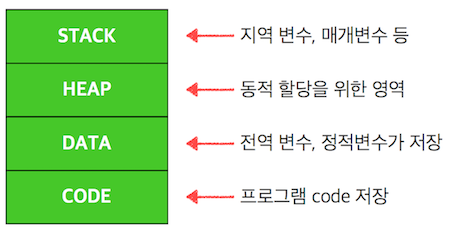
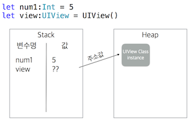
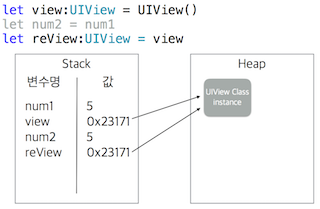

# 패스트캠퍼스 강의 노트 13th ( 20170524 )

# 오늘의 팁
 - 스토리보드, 레이블에서 텍스트를 넣은 후, 레이블 사이즈를 자동으로 맞추려면, <kbd>command</kbd> + <kbd>=</kbd> 을 누르면 된다.
 - `재귀 형태`는 메모리를 많이 먹지만, 연산은 적게 한다. 상대적으로 `for문`이 연산을 많이 한다.

# Classes & Structures ( 클래스와 구조체 )

> “Classes and structures are general-purpose, flexible constructs that become the
building blocks of your program’s code.
You define properties and methods to add functionality to your classes and structures
by using exactly the same syntax as for constants, variables, and functions.”

1. 프로그램 코드 블럭의 기본 구조이다.
2. 변수, 상수, 함수를 추가 할수 있다. ( 두 구조의 문법 같음 )
3. 단일 파일에 정의 되며 다른 코드에서 자동으로 사용 할수 있습니다. (접근 제한 자에 따라 접근성은 차이가 있다. `internal` 기본 접근제한자)
4. 초기 상태를 설정하기 위해 `initializer`가 만들어 지고, 사용자가 추가로 정의할 수 있다.
5. 사용 시 `인스턴스(instance)`라고 불린다.
6. 기본 구현된 내용에 기능을 더 추가해서 확장 할 수 있다. `(Extensions)`
7. 프로토콜을 상속받아 사용할수 있다. `(Protocols)`

- `Properties(프로퍼티)`는 클래스나 구조체를 정의하는 필수 요소.
- `Class`는 `Structure` 타입의 프로퍼티를 만들 수 있지만, `Structure`는 `Class` 타입의 프로퍼티를 만들 수 없다.

## Initialization ( 초기화 ) - #공통점
> Initialization is the process of preparing an instance of a class, structure, or enumeration for use.

1. 초기화는 인스턴스에 설정된 속성의 초기값을 설정과 초기화하는데 목적이 있다.
2. 클래스 및 구조체는 인스턴스로 만들어질 때 프로퍼티는 적절한 초기값으로 **모두 초기화 해야 한다**.
3. **모든 구조체**는 자동으로 `Memberwise Initializers`가 만들어 진다. ( 아래 예제 참고 )

```swift
struct Book {
    var name:String?
    var cost:Int?
    var isbn:UInt?
    
}

class BookStore {
    var name:String = ""
    var computerBooks:[Book] = []
    var address:String = ""
    
    func addBook(name: String, cost: Int) {
        let book:Book = Book(name: "책책책", cost: 10000, isbn: 98302)
        computerBooks.append(book)
    }
}
```
 - `Struct`인 Book에 별도 `Init`을 하지 않았는데, `Book(name: ...)`이 자동으로 만들어졌고, 실제 사용할 때, 이를 사용할 수 있었다.
 - `init(parameter)`을 여러개 만들어서 각각의 init을 가능하게 할 수 있다. ( 예: name만을 받는 init과 cost 만을 받는 `init` 선언이 가능함. )


# 값 타입 & 참조 타입

## Memory
- `STACK`: 지역 변수, 매개변수 등
- `HEAP`: 동적 할당을 위한 영역
- `DATA`: 전역 변수, 정적변수가 저장
- `CODE`: 프로그램 code 저장



## Pointer
> 포인터(pointer)는 프로그래밍 언어에서 다른 변수, 혹은 그 변수의 메모리 공간주소를 가리키는 변수를 말한다.

```swift
let num1:Int = 5 // 값 타입
let view:UIView = UIView() // 참조 타입 ( 레퍼런스 타입 )
```

- num1은 `5`라는 값을 바로 가질 수 있고, `STACK`에 저장된다.
- view는 값을 가질 수 없으므로, `HEAP` 영역의 주소 값을 갖고, 주소 값만을`STACK`에 저장한다.
- 기본 타입인 Int, UInt, String, Double, Char, Set, Dictionary, Array 등은 `Structure` 이다.

### 값을 저장한다는 것과 주소를 저장한다는 것의 차이


--

--

## Class와 Struct의 Value 값 저장 방식 차이
```swift
struct Book {
    var name:String?
    var cost:Int?
    var isbn:UInt?
}

class BookStore {
    var name:String?
    
    init(name: String) {
        self.name = name
    }
}
```

 - `Struct`는 `init`을 하지 않아도 자동으로 생긴다. ~엄청 편한듯~

```swift
print("// STRUCT //")
let b1:Book = Book(name: "나는야 스위프트 마스터", cost: 10000, isbn: 999)
var b2 = b1
b2.name = "나는야 자바 마스터"
print(b1.name!) // = "나는야 스위프트 마스터"
print(b2.name!) // = "나는야 자바 마스터"

print("// CLASS //")    
let bs1:BookStore = BookStore(name: "나는야 스위프트 마스터")
let bs2 = bs1
bs2.name = "나는야 자바 마스터"
print(bs1.name) // = "나는야 자바 마스터"
print(bs2.name) // = "나는야 자바 마스터"
```

 - `Struct`는 값을 복사해와서 본인(?)의 값을 바꾼다. ~그 녀석의~ 구조와 값을 가져와서 내 것으로 만든다고 생각하면 좋을 듯?
 - `Class`는 착해서(?) 내 것으로 만들지는 않고, 레퍼런스 값을 가져온다. 그래서 내 것으로 씌우지 않고, 그 녀석의 주소에 있는 Value를 바꾼다. ~뭐지. 착한게 아닌데?~
 - ~구조체 변수가 착해서 미안하니까.. 값을 가져와서 내 주머니에 넣고, 값을 바꾸고.. 클래스는 알고 보니 나쁜 놈(?)이라, 그 친구 주소만 가져와서 값을 바꿀 때, 그 친구의 값을 바꿔서 본인 것인 척을 한다.~
 - ~이해를 위해 제 멋대로 해석했습니다..~


## Classes Vs Structures ( 차이점 ) - #참조타입 #값타입

1. `Class`는 **참조 타입**이고, `Structure`는 **값 타입**이다.
2. `Class`는 상속을 통해 부모클래스의 특성을 상속받을수 있고, `Structure`는 상속을 받을 수 없다.
3. `Class`는 **Type Casting**을 사용할수 있고, `Structure`는 사용할 수 없다.
4. `Structure`의 프로퍼티는 instance가 var를 통해서 만들어야 수정 가능하다.
5. `Class`는 `Reference Counting`을 통해 인스턴스의 해제를 계산한다.
6. `Class`는 `deinitializer`를 사용할수 있습니다. ( `deinit()`으로 활용한다. )

// `Reference Counting`은 레퍼런스 값을 통해 레퍼런스가 +1 되기도, -1 되기도 하는데, 0이 되면, `UIView`가 사라진다. 옛날에는 이 레퍼런스를 개발자가 직접 세팅했고, 레퍼런스 값이 0이 되지 않으면, 메모리 누수가 발생했는데, Swift로 오면서 애플이 `Arc` 라는 개념으로 `오토 레퍼런스 카운팅` 작업을 해주고 있다. 그러나.. 결국 개발자가 신경 쓰기는 해야해서 다음 수업에서 개념에 대해 익히기로 한다.


# 결론? 애플의 가이드 라인
> (한줄요약) 그냥 좀 깊지만, 결국엔 데이터형..이라면, 구조체를 써보도록 하자.

 - 연관된 간단한 값의 집합을 캡슐화하는 것만이 목적일 때
 - 캡슐화된 값이 참조되는 것보다 복사되는 것이 합당할 때
 - 구조체에 저장된 프로퍼티가 값타입이며 참조되는 것보다는 복사되는 것이 합당할때
 - 다른 타입으로부터 상속받거나 자신이 상속될 필요가 없을 때

---
### 문서 끝 ( by 재성 )