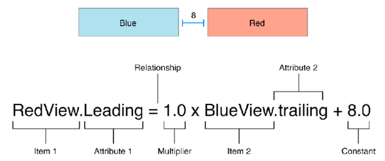
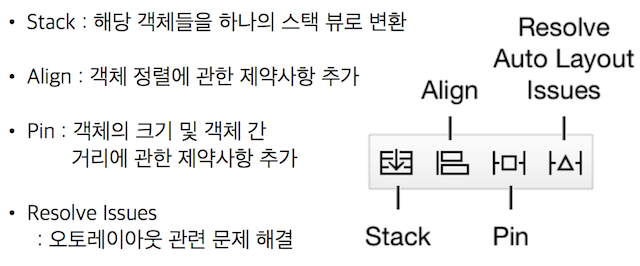
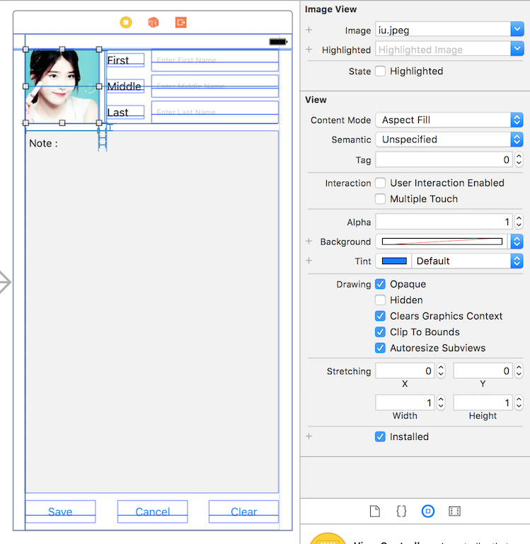

# 패스트캠퍼스 강의 노트 14th ( 20170525 )

# 오늘의 팁

## 하노이의 탑
 - 원판이 1개면, 출발지 --> 목적지
 - 원판이 1개가 아닌 경우
	 - n-1 개의 원판을 출발지에서 목적지를 거쳐 경유지로..
	 - n 번을 출발지에서 목적지로..
	 - n-1 개의 원판을 경유지에서 출발지를 거쳐 목적지로..
 - `핵꿀팁`: 원판을 옮긴다고만 생각하지 말고, **탑을 옮긴다**라고 생각하면, 이해가 쉬워진다.

### 로직 이해하기
```
[1:n-1] A --> B
	[1:n-2] A --> C
	[n-2]   A --> B
	[1:n-2] C --> B
[n]     A --> C
[1:n-1] A --> C
```

### 소스 참고
```
func moveNum(number n:Int, from vFrom:String, pass vPass:String, to vTo:String) {
    if n == 1 {
        textViewOfResult.insertText("\(n)번 원판을 \(vFrom)에서 \(vTo)로 이동\r")
    }else {
        
        moveNum(number: n-1, from: vFrom, pass: vTo, to: vPass)
        textViewOfResult.insertText("\(n)번 원판을 \(vFrom)에서 \(vTo)로 이동\r")
        moveNum(number: n-1, from: vPass, pass: vFrom, to: vTo)
    }
    
    tryNum += 1
}
```


# Auto Layout

## 오토 레이아웃
~오토레이아웃은 마우스로 오고 가는 GUI의 개념이어서.... 노트를 남기기 어렵..:O~

~그래도 이것저것 메모 시도...~

 - 다양한 디바이스에서 적당한 배치로 원하는 모양으로 요소들이 보이도록 하기 위해 도입되었다.
 - `스토리보드`에서 설정하기 원하는 객체를 마우스 오른쪽 버튼(or <kbd>ctrl</kbd> + 클릭)을 클릭하고, 기준으로 두고 싶은 객체까지 끌어당긴다.
 - 설정하기 원하는 객체 스스로에게 끌어당기면, width나 height 값을 고정적으로 줄 수 있다.
 - `Leading`은 왼쪽 좌표 / `Trailing`은 오른쪽 좌표.
 - `Mutlipier`를 통해 비율을 조정할 수 있다.
 
## contraint
 - Constraint: 각 뷰의 거리, 길이, 위치 등을 표현하기 위한 제약



### Attribute


### Multiplier
 - 비율을 통한 레이아웃 설정을 위한 속성

### Constant
 - 일정한 간격을 유지하기 위한 속성

### Tool


## AuoLayout 공식
```
Item1.Attribute = Multiplier(비율) X Item2.Attribute + Constant(간격)
```

## AutoLayout 실습 꿀팁

### 다양한 요소들 컨트롤하기
 - 이미지를 배치하고, AutoLayout을 먹인 후, `Clip To Bounds`하면 이미지가 설정해놓은 사이즈에 맞게 Clip 된다.
 - 고정해야 할만한 객체들을 먼저 정하고, 유동적으로 움직일 부분들을 세팅한다.
 - 위 예제에서는 아이유 `ImageView`와 First, Middle, Last의 `Label`들, 그리고 맨 아래 Save, Cancel, Clear `Button`들의 위치와 사이즈를 고정하고 나머지 영역들을 유동적으로 움직이도록 세팅하였다.
 


### 버튼 4개를 일정한 간격으로 배치하기
 - 버튼 4개를 화면의 왼쪽부터 일정한 간격으로 배치하는 방법.
 - 부모 뷰를 `Second Item`로 놓고, 가로 센터를 먹인 다음 옵션으로 가서 `Second Item`을 `Superview.Trailing`으로 먹이고, `Multiplier`에 **2/5**를 먹였다.
 - 버튼은 4개이지만, 간격은 5개이여서 5로 나누었더니, 만족스럽게 나온다.
 


---
### 문서 끝 ( by 재성 )
