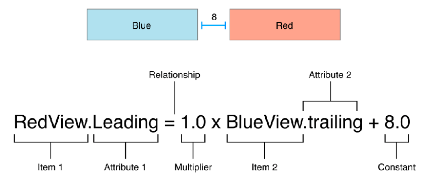
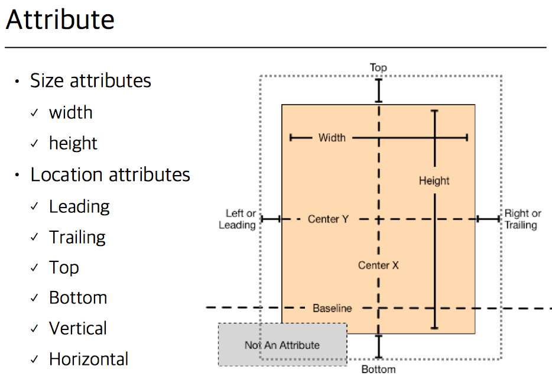
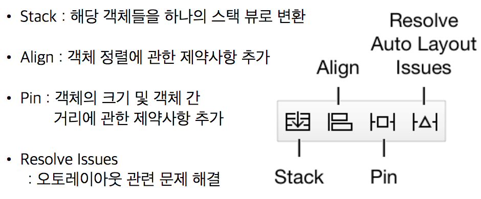
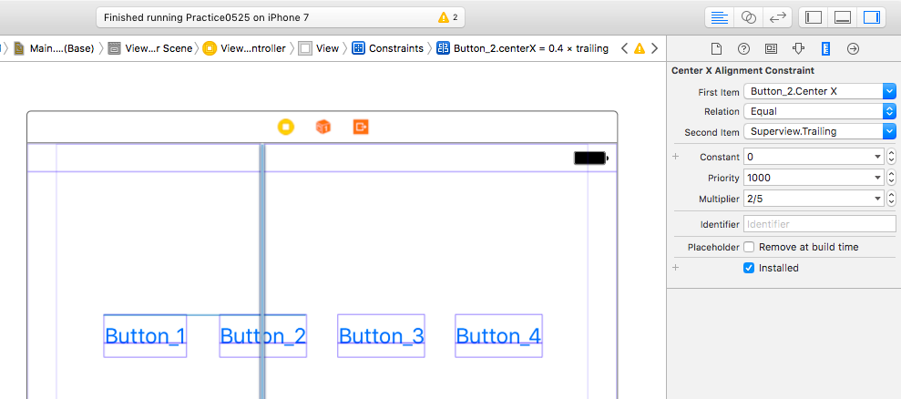

# 패스트캠퍼스 강의 노트 14th ( 20170525 )

# 오늘의 팁

## 하노이의 탑
 - 원판이 1개면, 출발지 --> 목적지
 - 원판이 1개가 아닌 경우
	 - n-1 개의 원판을 출발지에서 목적지를 거쳐 경유지로..
	 - n 번을 출발지에서 목적지로..
	 - n-1 개의 원판을 경유지에서 출발지를 거쳐 목적지로..
 - `핵꿀팁`: 원판을 옮긴다고만 생각하지 말고, **탑을 옮긴다**라고 생각하면, 이해가 쉬워진다.
 - ```
/* 로직 이해하기

     [1:n-1] A --> B
        [1:n-2] A --> C
        [n-2]   A --> B
        [1:n-2] C --> B
     [n]     A --> C
     [1:n-1] A --> C
     */  
```

### 소스 참고
```
func moveNum(number n:Int, from vFrom:String, pass vPass:String, to vTo:String) {
    if n == 1 {
        textViewOfResult.insertText("\(n)번 원판을 \(vFrom)에서 \(vTo)로 이동\r")
    }else {
        
        moveNum(number: n-1, from: vFrom, pass: vTo, to: vPass)
        textViewOfResult.insertText("\(n)번 원판을 \(vFrom)에서 \(vTo)로 이동\r")
        moveNum(number: n-1, from: vPass, pass: vFrom, to: vTo)
    }
    
    tryNum += 1
}
```


# Auto Layout

## contraint
 - Constraint: 각 뷰의 거리, 길이, 위치 등을 표현하기 위한 제약



### Attribute


### Multiplier
 - 비율을 통한 레이아웃 설정을 위한 속성

### Constant
 - 일정한 간격을 유지하기 위한 속성

### Tool


### AuoLayout 공식
```
Item1.Attribute = 비율 X Item2.Attribute + 간격
```

## AutoLayout 실습 꿀팁

### 버튼 4개를 일정한 간격으로 배치하기



---
### 문서 끝 ( by 재성 )