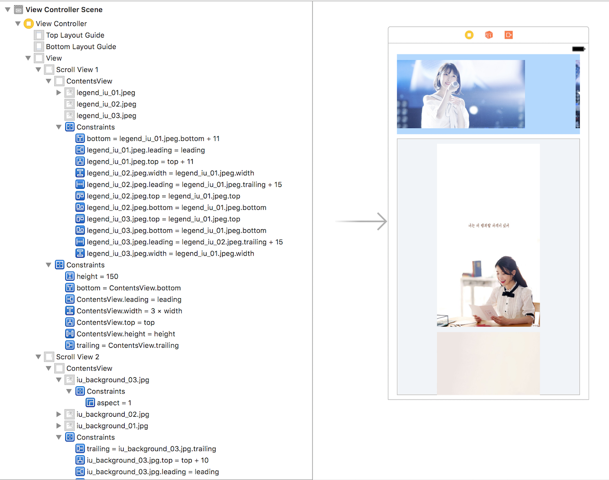

# 패스트캠퍼스 강의 노트 16th ( 20170529 )

# 오늘의 팁
 - Delegate는 많이 써보면서 익숙하게 만들자.
 - Delegate를 직접 만들어서 커스텀 UI를 만들 예정이다.
 - 스토리보드에서 `TextField`의 `Secure Text Entry` 값을 체크해주면, `Password` 텍스트필드처럼 **** 표시된다.
 - 

# UIScrollView

## ScrollView & ContentView
> (한줄 요약) 스크롤 뷰 안에는 콘텐츠 뷰가 필수로 들어간다! 그러나 스토리보드에는 콘텐츠 뷰로 부른 것이 없으므로 스크롤 뷰보다 큰 뷰를 스크롤 뷰 안에 넣어서 관리한다!

~한줄 넘었네..~

## 코딩으로 ScrollView 만들기
 - `UIScrollView`로 객체를 만들어서 스크롤뷰를 만든다.
 - 스크롤뷰의 콘텐츠 사이즈도 잡아준다.
 - 스크롤뷰의 옵션으로 페이지 넘기는 느낌이나, 바운스 등을 설정할 수 있다.
 - `self`는 루트 뷰 즉, `ViewController`를 가리키며, 명시적인 표시여서 이 경우에는 생략해도 괜찮다. ~그러나 생략하면, 나는 아직 어색하다.~
 - 뷰 객체에 `backgroundColor`를 줄 때, `UIColor.red`와 같은 식으로 값을 주어야하지만, 그냥 `.red`로 작성해서 타입 추론으로 UIColor를 생략할 수 있다.
 - `ImageView`는 객체를 만든 후에 그냥 파일명을 작성하면, 자동으로 추가된다. ( 그러나 소스에서는 아래 보이다시피.. )

```swift
class ViewController: UIViewController, UIWebViewDelegate {

    override func viewDidLoad() {
        super.viewDidLoad()
        // 스크롤뷰 만들기
        
        //frame은 테두리와 크기까지 잡은 것이고. bounds는 0,0이라는 좌표값만 가진 것이다? --> 둘의 차이점에 대한 재확인 필요.
        let sc:UIScrollView = UIScrollView(frame: self.view.bounds) //view.boudns: 화면을 꽉 차게 만든 것.
        sc.contentSize = CGSize(width: self.view.bounds.width * 5, height: self.view.bounds.height )
//        sc.contentInset = CGSize(width: CGFloat, height: CGFloat) // Inset은 스크롤뷰 안에 여백을 줄 때 사용한다.
        
        sc.isPagingEnabled = true
        // 페이지 넘기는 느낌을 준다.
        
        sc.bounces = true
        // 맨 끝점에서 튕기듯이 바운스한다.
        
        sc.refreshControl = UIRefreshControl.init()
        sc.refreshControl?.tintColor = .red
        // 스크롤 뷰 refreshControl 소스
        
        
        self.view.addSubview(sc)
        //self는 "ViewController"를 가리킨다. self는 명시적인 표시이고, 생략해도 괜찮다.
        
        let v1:UIView = UIView(frame: CGRect(x: self.view.bounds.width * 0, y: 50, width: self.view.bounds.width, height: self.view.bounds.height))
        v1.backgroundColor = .yellow
        sc.addSubview(v1) //sc에 콘텐츠뷰에 넣을 수 없다? 그냥 sc에 addSubview 한다.
        
        let v2:UIView = UIView(frame: CGRect(x: self.view.bounds.width * 1, y: 50, width: self.view.bounds.width, height: self.view.bounds.height))
        v2.backgroundColor = .red
        sc.addSubview(v2)
        
        let v3:UIView = UIView(frame: CGRect(x: self.view.bounds.width * 2, y: 50, width: self.view.bounds.width, height: self.view.bounds.height))
        v3.backgroundColor = UIColor.blue //타입 추론을 통해서 UIColor를 굳이 타이핑하지 않아도 된다. ~self 같은 느낌적인 느낌?~
        sc.addSubview(v3)
        
        let v4:UIImageView = UIImageView(frame: CGRect(x: self.view.bounds.width * 3, y: 0, width: self.view.bounds.width, height: self.view.bounds.height))
        v4.image = #imageLiteral(resourceName: "legend_iu_03.jpeg")
        v4.contentMode = .scaleAspectFit
        sc.addSubview(v4)
    }

    override func didReceiveMemoryWarning() {
        super.didReceiveMemoryWarning()
        // Dispose of any resources that can be recreated.
    }

}
```


### ScrollView의 Offset 설정으로 로그인 페이지에서 TextField 위로 올리기
 - 스크롤 뷰의 Offset 세팅으로 키보드가 올라올 때, 키보드로 TextField가 가려지는 문제를 해결할 수 있다.
 - 기존에 만들어진 뷰들을 스크롤 뷰 안에 넣고 싶을 때, 뷰들을 선택하고, Xcode 메뉴의 `Editor > Embed In - Scroll View`를 선택한다. ~물론 오토레이아웃이 망가진다.....~
 - `TextField`의 Delegate를 활용한다.
 - `textFieldDidBeginEditing`를 이용해서, `textField`에 Editing을 시작할 때, `CGPoint`의 y값을 먹인다.
 - 다시 `textFieldShouldReturn`를 이용해서, `CGPoint`의 값을 리셋한다.
 - **[ 핵꿀팁 ]** 스토리보드에서 전체를 ~바닥을~ 깔고 있는 뷰가 스크롤 뷰일 때, 스크롤 뷰 안에 있지 않은 요소를 움직이면, 스크롤뷰 안으로 자꾸 들어간다. 이 때, <kbd>command</kbd>를 누른 상태에서 움직이면, **스크롤 뷰 안으로 들어가지 않는다.**

```swift
class ViewController: UIViewController, UITextFieldDelegate {

    @IBOutlet weak var tfInsertID: UITextField!
    @IBOutlet weak var tfInsertPW: UITextField!
    @IBOutlet weak var svRoot: UIScrollView!
    
    override func viewDidLoad() {
        super.viewDidLoad()
        
        tfInsertID.delegate = self
        tfInsertPW.delegate = self
        
    }

    override func didReceiveMemoryWarning() {
        super.didReceiveMemoryWarning()
        // Dispose of any resources that can be recreated.
    }
    
    
    func textFieldDidBeginEditing(_ textField: UITextField) {
        svRoot.setContentOffset(CGPoint(x:0, y:250), animated: true)
    }
    
    func textFieldShouldReturn(_ textField: UITextField) -> Bool {
        textField.resignFirstResponder()
        svRoot.setContentOffset(CGPoint(x:0, y:0), animated: true)
        
        return true
    }

}
```

## 스토리보드로 ScrollView 만들기
 - 스토리보드에서 스크롤 뷰를 끌어오고, 사이즈를 잡는다. 스크롤 뷰의 사이즈는 디스플레이를 넘지 않는다.
 - 스크롤 뷰 안에 뷰를 추가해서 `ContentView`(콘텐츠 뷰)를 넣는다. 콘텐츠 뷰의 `Constraints`를 0, 0, 0, 0으로 먹인다. ( `height` 값은 나중에 유동적으로 만들어볼 수도 있고, 이 경우, `StackView`를 활용한다. )
 - 이 콘텐츠뷰 안에 레이블이나 이미지 뷰 그리고 아래에서 이야기하는 스택 뷰 등을 활용해서 뷰를 구성한다.

### 가로 스크롤 뷰와 세로 스크롤 뷰를 구성한 프로젝트의 스토리보드
 - 첫번째 가로 스크롤 뷰 안에 속한 콘텐츠 뷰의 width는 스크롤 뷰의 width에 3을 곱한 수를 넣어 무조건 스크롤 뷰보다 콘텐츠 뷰가 크도록 세팅하였다.
	 - `Scroll View 1 > ContentsView.width = 3 × width`
 - 두번째 세로 스크롤 뷰 안에 속한 콘텐츠 뷰의 bottom을 마지막 이미지의 bottom에 10을 더한 수를 넣어서 콘텐츠 뷰의 세로 사이즈가 이미지에 따라 유동적이도록 세팅하였다.
	 - `Scroll View 2 > ContentsView > bottom = iu_background_01.jpg.bottom + 10`



# Stack View

## 스택 뷰
 - 오토레이아웃에서 각 뷰들을 그룹핑하는.. 그런 류의 뷰이다.
 - 스택 뷰도 일종의 가상의 한 뷰이므로 하나의 객체와 같이 오토레이아웃을 먹일 수 있다.
 - 스크롤 뷰 안에 콘텐츠 뷰 안에 세로로 길어지는 스택 뷰를 먹여서 콘텐츠를 관리할 수 있다. 세로 형태의 스택 뷰는 **세로 길이를 콘텐츠 사이즈에 맞출 수 있으므로** 스크롤 뷰의 콘텐츠 뷰 사이즈를 관리할 때, 아주 좋다.
 - 스택 뷰 안에서 긴 텍스트를 보여줄 때, `Label`을 사용하고, 레이블의 `Lines` 값을 `0`을 준다. 레이블은 **줄 수에 따라 세로 사이즈를 유동적으로 관리**할 수 있으므로, 스택 뷰와 사용할 때 아주 좋다. ~그렇다고 한다.~

### 박종찬 조교님의 AutoLayout 꿀팁
// 스크롤 뷰 안에 스택 뷰, 그리고 또 다시 스택 뷰를 갖는 뷰를 만들어보자.

~정리를 하기는 했지만.. 조교님이 말씀하시는 깨알팁들을 제가 알아듣기 편하도록 메모한 내용 위주입니다.~

1. `Label`은 `Constraints`의 값을 가볍게 3개의 값만 주고, `Lines`를 0으로 주면, 텍스트를 받아서 줄 처리를 한다. ( 세로 사이즈를 알아서 조절한다. )
2. `Root ScrollView`를 주고, `Root ContentView`를 주고, 그 아래에 `Root StackView`를 준다.
3. 요렇게 indent 관리를 하면, `Constraints`를 읽기 편하고, 협업 시에 이는 매우 중요하다.
4. **[ 깨알팁 ]** `Root ContentView`의 `width` 값은 루트 뷰의 `width` 값의 `32`를 뺀다. 양 쪽에서 16을 빼서 여백을 주고, 사용자에게 보여주려는 내용이 스크롤에 가리지 않기 위함이다. 왜냐하면, 나중에 아래에 이미지를 넣으면, **이미지는 스택 뷰에 양쪽 여백 없이 딱 맞추고, 텍스트만 좌우 양쪽 여백을 주기 위함**이다. ~이쁘게 이쁘게~
5. `Root StackView` 안에는 `스택 뷰 + 레이블 + 스크롤 뷰`가 위에서부터 아래로 들어가 있다.
6. **[ 깨알팁 ]** 테이블 뷰는 스크롤 뷰를 상속 받는다.
7. iOS에서는 내비게이션 컨트롤 뷰가 많이 사용되므로 뷰를 잡은 뒤, `Editor > Embed in > Navigation Controll View`를 누른다.
8. **[ 핵꿀팁 ]** 내비게이션 컨트롤 뷰에서 `ScrollView`를 넣을 때, `Center Vertical`을 먹이고, `height`를 부모 뷰와 동일하게 먹인다. 그러면, 내비게이션 바 뒤로 콘텐츠가 스크롤 되어서 이쁘게 보인다.

// 이제 진짜 뷰를 구성하기 시작한다.

1. `ScrollView` 안에 `ContentView`를 먹이고, `Contraints`에 "0 0 0 0"을 먹이고, 최종적으로 `Equal Width`를 먹인다. `height`는 1000을 먹인다. ( 이건 후에 재설정한다. )
2. `Adjust Scroll View Inset` : 스크롤 뷰는 내비게이션 바 뒤에서 시작되지만, 콘텐츠는 내비게이션 바에 가리지 않고, 내비게이션 바의 바로 아래에서 시작되어야 한다. 이 값을 조절하면, 내비게이션 바 바로 아래에서 콘텐츠가 시작된다.
3. `Vertical Stack View`를 던져놓고, 스택 뷰는 세로 크기를 받아올 수 있으므로, 가로 크기만 먹여본다. `Center Horizontal`을 먹이자.
4. 스택 뷰의 세로 위치는 `Top Space = 0`을 먹여보자.
5. `Label`을 스택 뷰 안에 넣고, `Label`의 세로 크기도 텍스트 길이에 따라 유동적이므로 스택 뷰의 세로 크기는 곧바로 자동으로 가져온다. `Label`의 `Lines`를 `0`으로 먹이면, 여러줄이 된다.
6. `Label`의 `Alignment`와 `Distribution`을 `Fill`을 넣으면, 스택 뷰의 사이즈를 따라간다.
7. **[ 깨알팁 ]** `TextView`는 보통 장문의 텍스트를 사용자로부터 **입력** 받을 때에 사용하고, `Label`은 사용자에게 장문, 단문 가리지 않고 텍스트를 **출력** 해주는 용도로 사용한다.
8. `Label` 위에 `StackView`를 먹이고, `width`를 준다음, `ratio`로 `height`을 계산하도록 했다.
9. **[ 핵꿀팁 ]** 스택 뷰 안에 스택 뷰를 넣고, 넣고.. 그럴 때, `Distribution`을 `Equal Spacing`으로 준다. 그래야 부모가 되는 스택 뷰의 `Space`를 자식이 되는 스택 뷰에게도 전달해줄 수 있다.
10. `ScrollView`의 콘텐츠 뷰에서 루트 스택 뷰에다가 끌어가서 `Equal height`를 먹이면, 콘텐트 뷰의 height 값이 루트 스택 뷰의 `height`에서 가져와서 먹여진다.


---
### 문서 끝 ( by 재성 )